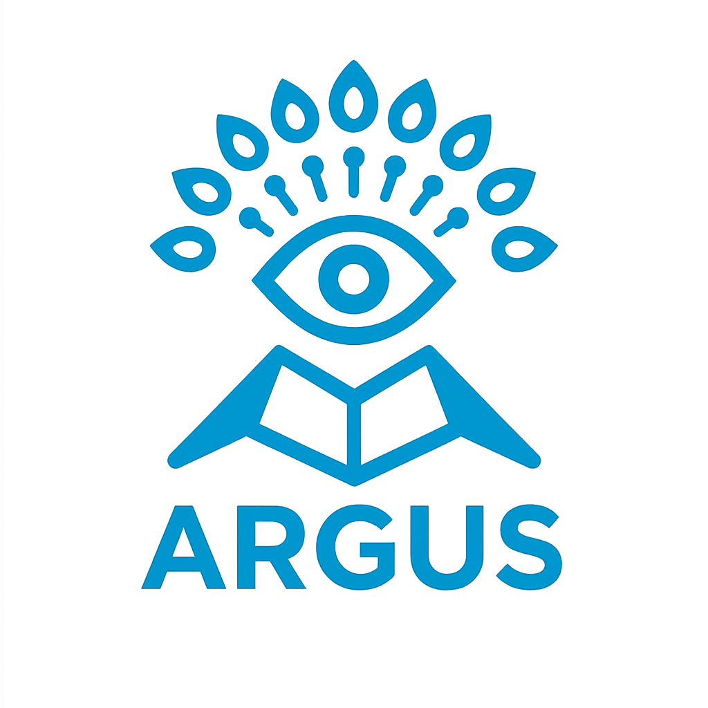

# ARGUS

https://argus-lp.vercel.app/

## リリース運用

Android AAB のproduction / closed test配信とバージョン更新オプションは [docs/release.md](docs/release.md) を参照してください。

iOS 開発用 MacBook の初回セットアップは [docs/macbook_ios_setup.md](docs/macbook_ios_setup.md)、署名、実機テスト、Archive 手順は [docs/ios_release.md](docs/ios_release.md) を参照してください。
