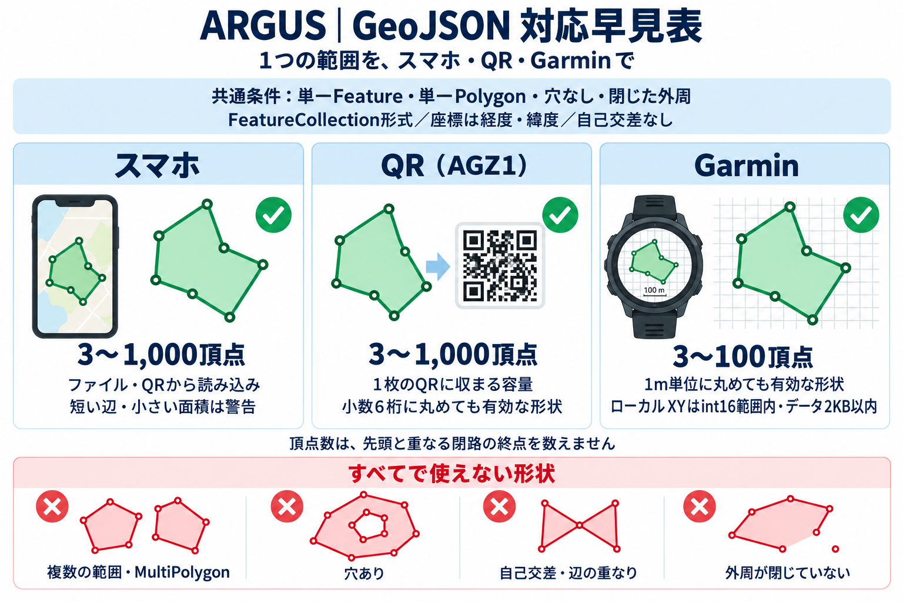
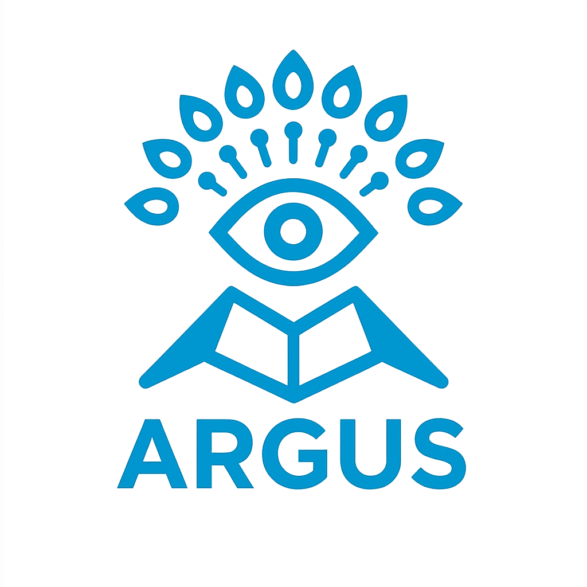

# ARGUS

https://argus-lp.vercel.app/


[](https://github.com/nanigasi-san/Argus/actions/workflows/flutter_tests.yml)
[](https://codecov.io/gh/nanigasi-san/Argus)

テスト・ビルド・E2Eのワークフロー構成は [docs/ci.md](docs/ci.md) を参照してください。

ARGUSはGeoJSON／QRから読み込んだ範囲をスマホ上で監視する。起動時に「スマホで利用」または「GARMINだけで利用（試験機能）」を選べる。GARMIN向けは対応するConnect IQ Data Fieldへ範囲を送り、保存ACK後に時計のRun画面で監視する。対応機種・事前準備は [GARMINセットアップ](docs/garmin_supported_devices.md)、転送制限と期限・停止の仕様は [GARMIN転送データ形式](docs/garmin_data_format.md) を参照。

## はじめて使う

- [スマホで使う（画像付き）](docs/guides/phone.md)
- [GARMINで使う（画像付き）](docs/guides/garmin.md)
- [ドキュメント一覧](docs/README.md)

## 対応するGeoJSON

スマホ・QR・Garminは、**FeatureCollection内の単一Feature・単一Polygon**を使用します。外周は閉じた穴なしの形状とし、自己交差・辺の重なり・面積0は拒否します。複数FeatureとMultiPolygonはスマホでも使えません。



| 利用先 | 頂点数 | 追加条件 |
| --- | --- | --- |
| スマホ | 3〜1,000点 | ファイル・QRから読み込み。短い辺・小さい面積は警告として表示 |
| QR（AGZ1） | 3〜1,000点 | 1枚のQRの容量内で、小数6桁への丸め後も有効な形状 |
| Garmin | 3〜100点 | 約1m単位への丸め後も有効な形状。ローカルXYがint16範囲内、AGW1データが2,048バイト以内 |

頂点数は、先頭と重なる閉路の終点を除いて数えます。1,000点以内でもQRの容量に収まらない場合は生成できません。QR生成画面の対応表示は、QRから復元されるデータに基づきます。詳しい判定と形状例は[GeoJSON検証基準](docs/geojson_validation.md)・[検証レポート](docs/geojson_validation_report.md)を参照してください。

## 開発する

[現行仕様](docs/spec.md)・[構成図とクラス図](docs/architecture.md)・[テスト手順](docs/tests.md)を参照してください。

```sh
flutter pub get
flutter analyze
flutter test
```



## CIとマージ条件

mainへの変更はPR経由でマージします。以下の5つのGitHub Actionsチェックが
すべて成功していることがマージ条件です。

- `Flutter Tests`
- `Android Build` / `iOS Build`
- `Android E2E` / `iOS E2E`

CIが未完了・失敗・キャンセルの場合はマージできません。
この条件は管理者にも適用されます。
設定は [protect-mainルールセット](https://github.com/nanigasi-san/Argus/rules/9448222)
で管理しています。各チェックの内容と実行条件は [docs/ci.md](docs/ci.md) を参照してください。

## リリース運用

Android AAB のタグ起動によるproduction配信は [docs/release.md](docs/release.md) を参照してください。

iOS 開発用 MacBook の初回セットアップは [docs/macbook_ios_setup.md](docs/macbook_ios_setup.md)、署名、実機テスト、Archive 手順は [docs/ios_release.md](docs/ios_release.md) を参照してください。
