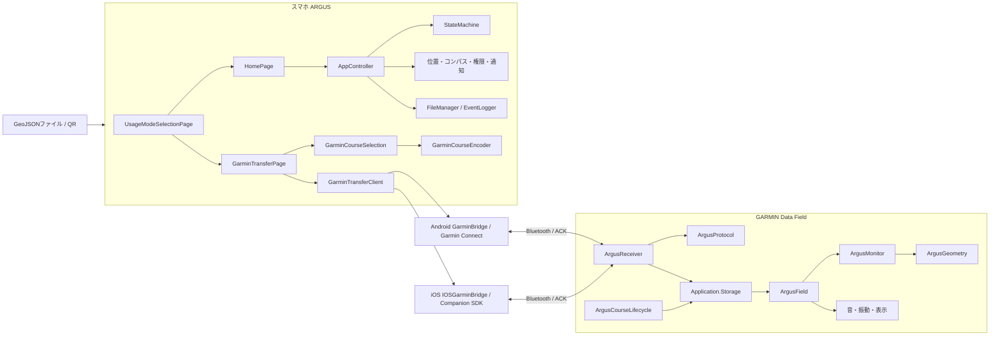
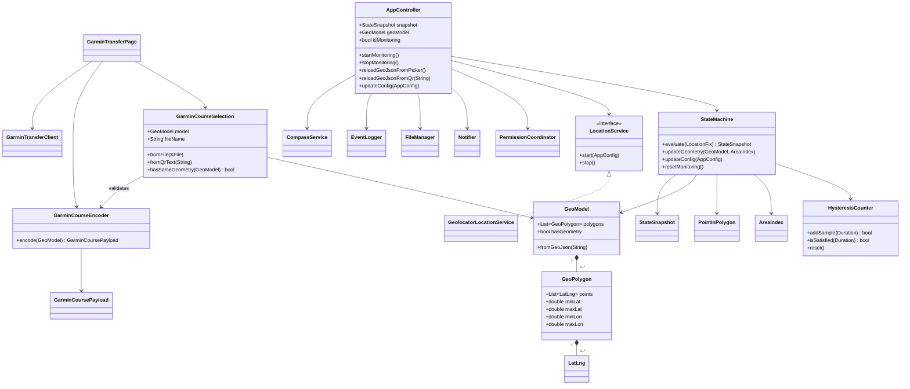
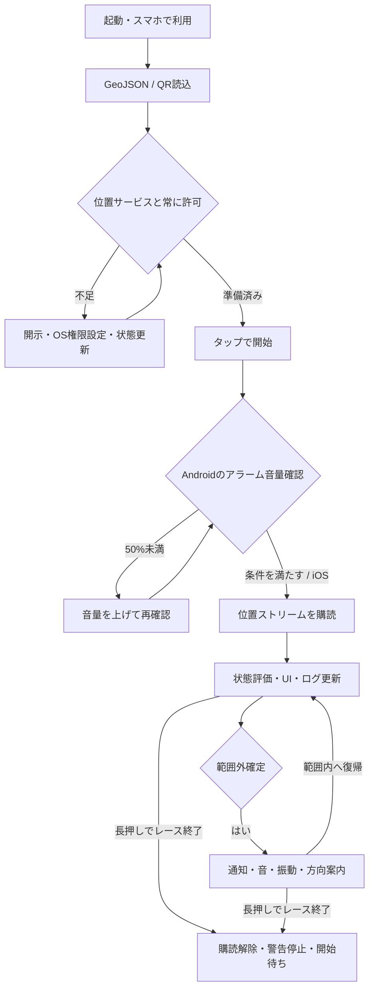
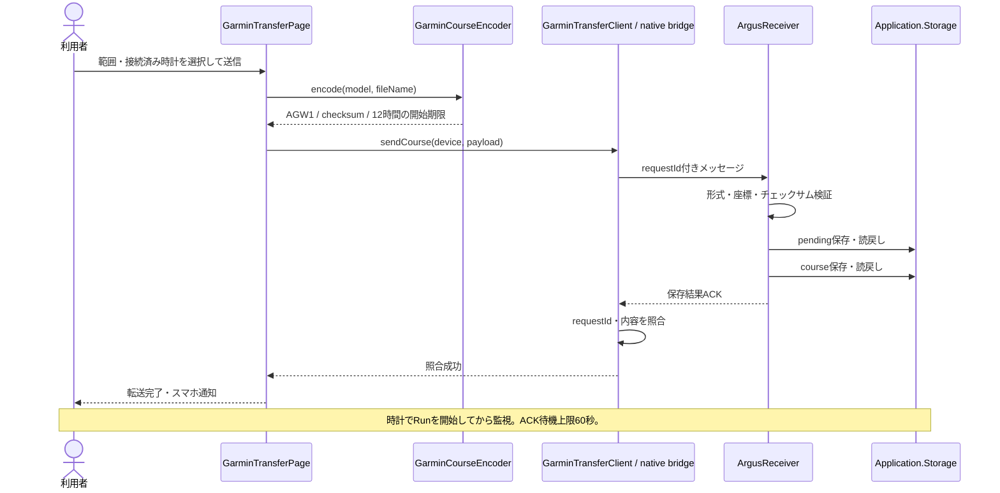
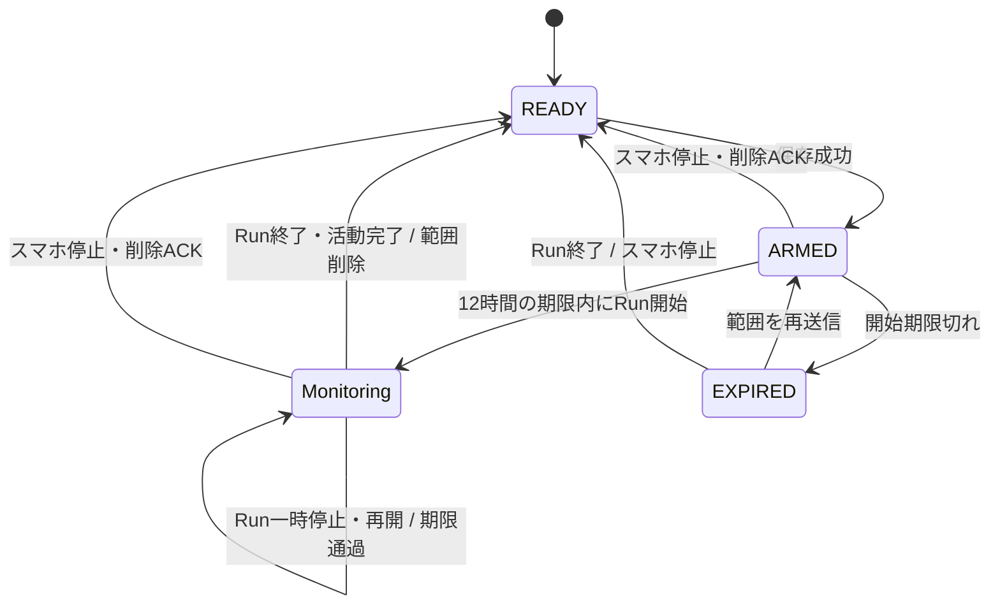

# ARGUSの構成と処理フロー

確認日: 2026-09-29。現行仕様は[仕様書](spec.md)、利用手順は[スマホ](guides/phone.md)・[GARMIN](guides/garmin.md)を参照。
図の名前は実装のクラス・モジュールに対応する。QR codecはトップレベル関数群であり、`GeoJsonQrCodec`というクラスは存在しない。

## システム構成

GARMIN用のファイル・QR選択は`GarminCourseSelection`に保持する。スマホ監視中に別の範囲を選んでも、スマホの`GeoModel`と監視を差し替えない。異なる範囲の送信時は確認を表示する。

## 主要クラス

`GeoModel.polygons`と`GeoPolygon.points`は変更不可のコピー。モデルと`AreaIndex`の構築後に呼び出し側が元のリストを変更しても、判定対象が食い違わない。

## スマホでの開始・停止

Androidの音量取得失敗はログを残して開始を許可する既存仕様。通知権限は推奨だが開始の必須条件ではない。スマホの状態遷移・GPS不良時の例外は[仕様書の状態遷移](spec.md#431-状態遷移図)を参照。

## GARMINへの転送

## 時計のデータ寿命

Run終了処理は`requestId`を照合するため、遅れて届いた古い終了イベントで新しい範囲を削除しない。未開始のまま期限を過ぎても自動削除タイマーは動かない。詳細は[転送仕様](garmin_data_format.md)。

## ディレクトリの役割

| 場所 | 責務 |
| --- | --- |
| `lib/ui` / `lib/theme` | 画面・配色・文字。選択/転送画面の共通色は`AppPalette` |
| `lib/geo` / `lib/state_machine` | 形状、境界計算、スマホの状態判定 |
| `lib/qr` / `lib/garmin` | QR変換、GARMIN転送候補・AGW1変換 |
| `lib/platform` / `android` / `ios` | OS・センサー・通知・GARMIN SDKとの接続 |
| `garmin/argus-data-field` | 時計の受信・保存・Run監視・削除 |
| `test` / `integration_test` / `scripts` | 回帰テスト、全E2E、CIと配信の補助処理 |

座標計算や警告の境界条件を変える場合は、まず該当する層の回帰テストで変更を明示し、スマホと時計の判定条件を混同しない。
