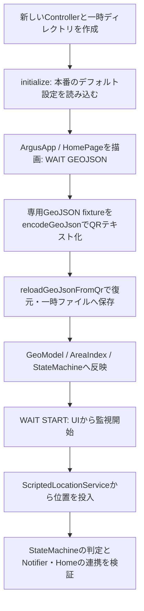

# ARGUS E2Eテストの流れ

関連Issue: [#48 Android E2E CI整備](https://github.com/nanigasi-san/Argus/issues/48)

この資料は、実装済みE2Eの操作・入力・期待結果をまとめる。
実行コマンドとArtifactの取得方法は
[integration_test/README.md](../integration_test/README.md) を参照。

## 1. テストの役割と実行範囲

| 層 | ファイル | 目的 | Android E2E CIでの実行 |
| --- | --- | --- | --- |
| UI smoke | `integration_test/ui_smoke_test.dart` | モバイルランタイムで主要画面の描画・遷移を確認 | PR / main push / 手動 |
| Core monitoring E2E | `integration_test/core_monitoring_e2e_test.dart` | GeoJSON読込から監視・警告・復旧まで、本番コンポーネントの連携を確認 | PR / main push / 手動 |
| コンパスE2E | `integration_test/compass_navigation_test.dart` | 範囲外から境界へ戻るための距離・方向案内を確認 | PR / main push / 手動 |
| iOS Simulator GPSオプション | 上記コンパスE2Eの `SIMULATOR_GPS=true` | 実Geolocator経由の仮想GPS受信と案内の表示・解除を確認 | macOSで個別実行 |
| Android Platform E2E | 未実装 | adb位置注入 → 実Geolocator → 範囲外判定 | 今後、手動の別jobとして追加 |

Core E2Eの状態は、各位置投入後にControllerのsnapshot、Notifierのbadge、
Homeの状態表示が一致することを確認する。
警告は本物のNotifierが動作させる通知・音・振動のテスト実装で観測する。

## 2. Core E2Eの共通準備



- `debugSeed()` は使わない。QRはファイル名も復元する `agz1` 形式を使う。
- モデル読込後は `geoJsonLoaded == true`、`waitStart`、ファイル名の復元を確認する。
- 開始は `monitoringStatusButton` のタップから行い、LocationServiceの開始と購読数1を確認する。
- ファイルピッカー・カメラ・OS権限ダイアログは操作しない。
- 初期化・テスト・後片付けを `testWidgets` 本体内で実行し、そのいずれの失敗もdriverへ伝える。
- 各シナリオ終了時は画面を外し、監視・警告・購読・スヌーズタイマー・一時ファイルを解放する。

### 共通の位置データと設定

専用fixtureは北緯35.000〜35.010、東経139.000〜139.010の正方形。
コンパスE2Eのfixtureとは別の座標を使う。

| 名前 | 緯度 | 経度 | 意味 |
| --- | --- | --- | --- |
| `inside` | 35.005 | 139.005 | 十分に境界から離れた範囲内 |
| `outside` | 35.005 | 139.020 | 東側の範囲外 |
| `bufferProbe` | 35.005 | 139.0004 | 西側境界から約36 mの範囲内。30 m設定ではINNER、50 m設定ではNEAR |

| 設定・入力 | 値 |
| --- | --- |
| 初期の境界バッファ | 30 m |
| 範囲外確定のサンプル数 | 3 |
| 範囲外確定の経過時間 | 10秒 |
| GPS_BADの精度閾値 | 40 m |
| 通常fixの精度 | 5 m |
| 低精度fixの精度 | 100 m |

以下の表の「経過」は `LocationFix.monitoringElapsed`。
壁時計を待たず、この値とサンプル数でヒステリシスを進める。

## 3. Core E2Eの各フロー

### C1. 監視開始 → 範囲外 → 警告 → 範囲内復帰

テスト名: `monitor-exit-recover`

| 手順 | 操作・入力 | 期待する状態 | 警告 |
| --- | --- | --- | --- |
| 1 | 共通準備でGeoJSONを読み込む | WAIT START | 停止 |
| 2 | Homeの開始ボタンをタップ | 位置ストリームの購読開始 | 停止 |
| 3 | inside、経過0秒 | INNER | 停止 |
| 4 | outside、経過1秒 | OUTER_PENDING | 停止 |
| 5 | outside、経過5秒 | OUTER_PENDING | 停止 |
| 6 | outside、経過11秒 | OUTER | 通知・音・振動を開始 |
| 7 | inside、経過12秒 | INNER | 通知取消・音と振動を停止 |

最初のoutsideから10秒経過し、範囲外fixも3つになった時点で確定する。
警告の開始は1回だけ、復帰時の停止と通知取消を確認する。
OUTER確定画面と復帰後の画面を保存する。

### C2. GPS_BAD → 精度回復

テスト名: `gps-bad-recover`

| 手順 | 操作・入力 | 期待する状態 | 警告 |
| --- | --- | --- | --- |
| 1 | GeoJSON読込 → UIからSTART | 監視開始 | 停止 |
| 2 | inside、経過0秒、精度5 m | INNER | 停止 |
| 3 | outside、経過1秒、精度100 m | GPS_BAD | 発火しない |
| 4 | inside、経過2秒、精度5 m | INNER | 発火しない |

範囲外座標でも、未確定の状態で精度が悪い場合はGPS_BADにする。
正常精度へ戻ると位置判定が復旧し、途中で誤警告が出ていないことを確認する。

### C3. OUTER中の低精度化 → 警告維持 → 実際の復帰

テスト名: `outer-survives-low-accuracy`

| 手順 | 操作・入力 | 期待する状態 | 警告 |
| --- | --- | --- | --- |
| 1 | C1の手順6まで実行 | OUTER | 開始済み |
| 2 | outside、経過12秒、精度100 m | OUTERを維持 | 継続、停止・通知取消なし |
| 3 | inside、経過13秒、精度100 m | INNER | 解除 |

確定済みの範囲外判定は、精度の悪化だけでは取り消さない。
範囲内へ実際に戻ったと判定できた場合にのみ警告を解除する。
低精度化で通知が再発行されないことも確認する。

### C4. 判定待ちでSTOP → 再START

テスト名: `stop-restart-clears-pending`

| 手順 | 操作・入力 | 期待する状態・処理 |
| --- | --- | --- |
| 1 | START → inside 0秒 → outside 1秒・5秒 | OUTER_PENDING、範囲外サンプル2つ |
| 2 | 「長押しでレース終了」を5秒間押す | WAIT START、位置サービス停止、購読0、警告停止 |
| 3 | 停止中にoutside 100秒を投入 | 処理・ログ記録されず、WAIT STARTを維持 |
| 4 | UIから再START | 位置サービスの開始2回目、購読1 |
| 5 | outside 50秒を投入 | OUTER_PENDING、サンプル数1、警告なし |
| 6 | inside 51秒を投入 | INNER、位置1つにつきログ1件 |

再開後の最初のoutsideは、以前より遅い経過値でも旧サンプルを引き継がない。
5秒は実際のUI長押しに必要な時間で、GPSヒステリシス待機ではない。

### C5. 警告中にSTOP → 再START

テスト名: `stop-restart-clears-alarm`

| 手順 | 操作・入力 | 期待する状態・警告 |
| --- | --- | --- |
| 1 | C1の手順6まで実行 | OUTER、警告中 |
| 2 | UIで長押し終了 | WAIT START、通知・音・振動を解除、購読0 |
| 3 | 停止中にoutsideを投入 | 状態を変更しない |
| 4 | UIから再START → outside 50秒 | OUTER_PENDING、旧警告は停止したまま |
| 5 | inside 51秒 | INNER、購読1、位置を重複処理しない |

旧OUTER状態・アラーム・ヒステリシスが再開後に残らないことを確認する。

### C6. 権限不足 → 開示画面 → 権限更新 → START

テスト名: `permission-setup-refresh-start`

| 手順 | 操作・入力 | 期待する状態・UI |
| --- | --- | --- |
| 1 | gatewayをdeniedにしてrefresh → 共通準備 | WAIT START、開始不可、Homeにセットアップカード |
| 2 | 「監視開始前に設定する」をタップ | バックグラウンド位置情報の開示画面 |
| 3 | deniedのまま「同意して位置情報の設定へ進む」 | Homeへ戻るが開始不可、位置サービス未開始 |
| 4 | gatewayをgrantedへ変更 → 「状態を更新」 | 開始可能、セットアップカードが消える |
| 5 | UIからSTART → inside 0秒 | INNER、警告なし |

同意とOS権限の付与を区別する。CoreではOS権限状態のみ変更し、
Androidのnative dialog自体の操作は対象にしない。

### C7. 設定変更 → 自動再開 → 新しい境界閾値で判定

テスト名: `settings-update-monitoring-buffer`

| 手順 | 操作・入力 | 期待する状態・処理 |
| --- | --- | --- |
| 1 | START → bufferProbe 0秒、バッファ30 m | INNER |
| 2 | Homeのメニュー → 設定 → 境界バッファへ50を入力 | Settingsのフォームで変更 |
| 3 | スクロールして「設定を反映」をタップ | updateConfig → 監視停止 → 設定保存 → 自動再開 |
| 4 | Controller・位置サービス・保存ファイルを確認 | すべて50 m、開始2回目、購読1 |
| 5 | Homeへ戻り、同じbufferProbe 0秒を再投入 | NEAR、警告なし |

再開した監視が旧30 mではなく新50 mを使うことを、同一座標の判定差で確認する。

### C8. OUTER中のスヌーズ → 状態維持 → 復帰

テスト名: `outer-snooze-keeps-state`

| 手順 | 操作・入力 | 状態 | 音・振動／通知 |
| --- | --- | --- | --- |
| 1 | C1の手順6まで実行 | OUTER | 警告中 |
| 2 | 「1分間音を停止する」をタップ | OUTER、isAlarmSnoozed=true | 音・振動停止 |
| 3 | outside 12秒を投入 | OUTER維持 | 音は再開せず、通知の追加発行なし |
| 4 | inside 13秒を投入 | INNER、isAlarmSnoozed=false | 音・振動停止、通知取消 |

位置の安全状態と警告の再生状態を分けて扱うことを確認する。
1分経過による再開タイマーの網羅はUnit test側で扱い、E2Eでは待たない。

## 4. UI smokeの各フロー

このsuiteは既存Harnessで画面表示に必要な状態を準備する。
CoreのGeoJSONロード・範囲外判定を通す役割は持たない。

| ID | 操作・準備 | 確認する結果 |
| --- | --- | --- |
| S1 | GeoJSONあり、通知とバックグラウンド位置情報が未許可 → Home表示 | セットアップカード、「監視開始前に設定する」、「通知を許可」 |
| S2 | 常に許可が未設定 → Homeの設定導線をタップ | 開示画面。Androidは同意ボタン、iOSは「続ける」 |
| S3 | Settingsを描画 | 設定フォーム、監視可能のカード、境界バッファ。iOSはスクロールして警告音テストも確認 |
| S4 | カメラdeniedのQR画面を描画 | カメラ権限エラーと「再試行」 |
| S5 | Homeのメニュー → 「設定」 | Settingsへ遷移 |

S1〜S4の画面をスクリーンショットとして保存する。

## 5. コンパスE2Eの流れ

テスト名: `outside navigation follows location and device heading`

この既存suiteは緯度・経度0〜1の正方形と、短いテスト用ヒステリシス設定を使う。
Androidでもスクリーンショットを取れるよう、テスト内でsurface変換を行う。
位置・方位は仮想サービスから投入し、案内とHomeは本番の実装を通す。

| 手順 | 操作・入力 | 確認する結果 |
| --- | --- | --- |
| 1 | UIからSTART → (0.5, 0.5)、経過0秒 | INNER、コンパスポインターなし |
| 2 | (0.5, 1.001)、経過1秒・3秒 | OUTER、境界まで約111 m、目標方位は約270度、方位未取得の案内 |
| 3 | 端末方位 = 目標−90度 | 「90度右を向いてください」、ポインターと東西南北ラベル |
| 4 | 端末方位 = 目標＋90度 | 「90度左を向いてください」 |
| 5 | 端末方位 = 目標−29度 | 「前へ」 |
| 6 | 端末方位 = 目標−31度 | 「31度右を向いてください」 |
| 7 | 方位null → 目標方位と一致 | 未取得時はポインターなし、一致時は「前へ」 |
| 8 | (0.5, 1.0005)、経過4秒 | 境界まで約56 mへ更新 |
| 9 | (0.5, 0.5)、経過5秒 | INNER、方向案内とポインターを解除 |
| 10 | UIで長押し終了 | WAIT START、位置サービス停止 |

右向き案内と前進案内の画面を保存する。

### 既存のiOS native GPSオプション

`SIMULATOR_GPS=true` と `ARGUS_SIMULATOR_ID` を指定した場合に追加実行する。
driverが `simctl privacy` で位置権限を付与し、2秒おきに仮想位置を送る。
範囲外と範囲内を約20秒ずつ交互に移動する。

```text
simctlで権限付与・範囲外位置を送信
 → UIからSTART
 → 実GeolocatorLocationServiceで新しいPositionを受信
 → OUTER、境界距離50 m超、磁気センサーなしの案内
 → simctlが範囲内へ移動
 → INNER、ナビゲーション表示を解除
 → driver終了前に位置注入とタイマーを解除
```

これは既存の個別実行オプションで、今回のAndroid E2E CIには含めない。

## 6. CIでの実行・失敗時の調査

```text
PR / main push / 手動実行
 → Ubuntu + Java 17 + Flutter stable
 → KVM有効化 → API 36 emulator起動
 → integration_test/とe2e/の全*_test.dartを再帰的に検出
 → コンパス・Core E2E・UI smokeを順に実行
 → 1件でも失敗すればjobを失敗にする
 → エミュレーター終了前にlogcatと最終画面を保存
 → Step SummaryとArtifactを保存
```

一部のsuiteが失敗しても、残りのsuiteを実行する。
driverはスクリーンショットをホスト側に書き出し、Coreの例外時は
後片付け前の失敗画面も取得する。

| 調査対象 | 保存先 |
| --- | --- |
| 状態やUIの違い | `build/integration_test/screenshots/` |
| assertion・driver・ビルドのエラー | `build/e2e/integration_test_ui_smoke.log` / `build/e2e/integration_test_core_monitoring_e2e.log` / `build/e2e/integration_test_compass_navigation.log` |
| 自動検出した実行ファイル | `build/e2e/suites.txt` |
| suiteごとの成否 | `build/e2e/results.txt` |
| Android native側のエラー | `build/e2e/logcat.txt` |
| ランタイム差 | `build/e2e/flutter-version.txt` / `build/e2e/android-api.txt` |
| 終了時の端末画面 | `build/e2e/final-screen.png` |

Artifact名は `android-e2e-diagnostics`、保存期間は14日。
必須チェックとして設定する際のjob名は `All Android E2E`。
workflowの追加と、リポジトリ側で必須チェックに指定する設定は別の作業になる。

### PR提出前の全件実行

`AGENTS.md` は、PRを作成・提出する前に全E2Eを実行し、成功を確認するよう定める。
対象は現在の `integration_test/`、および今後追加する `e2e/` 配下の
`*_test.dart`。新しいファイルは両スクリプトが自動検出する。

```powershell
./scripts/run_android_ui_checks.ps1 -CaptureScreenshots
```

```sh
# Linux / macOS / Git Bash。エミュレーターを先に起動しておく。
bash scripts/run_android_e2e.sh emulator-5554
```

一部のファイルだけを実行してPRを提出しない。
実行コマンド・端末/API level・実行ファイル・成否をPR本文に記録し、
失敗・実行不可の場合は該当ファイルと理由を報告する。
OS固有の任意モードは、通常の全件実行と区別して実行有無を記録する。

## 7. Android Platform E2Eとして残るフロー

実GeolocatorのAndroid E2Eと実Androidのbackground/resumeは未実装。
CoreのPRチェックとは別の手動jobから始める。

```text
テストアプリをインストール
 → adbで位置・バックグラウンド位置・通知の権限を付与
 → 端末の位置情報サービスを有効化
 → 本物のGeolocatorLocationServiceでSTART
 → 開始後にadb emu geo fixでinsideを送信
 → INNER / NEAR
 → outsideを複数回送信し、実時間の確定条件を待つ
 → OUTER
 → insideを再送信
 → 安全状態へ復帰
```

`adb emu geo fix` の引数は経度→緯度。
監視開始以前のPositionは破棄されるため、位置は開始後に注入する。
PlatformではCoreの `monitoringElapsed` を指定できず、実時間の待機が必要。
OS権限ダイアログ、バックグラウンド受信、実通知、警告音・振動、カメラ、
磁気センサーの実機動作はCore E2Eの保証範囲には含めない。
