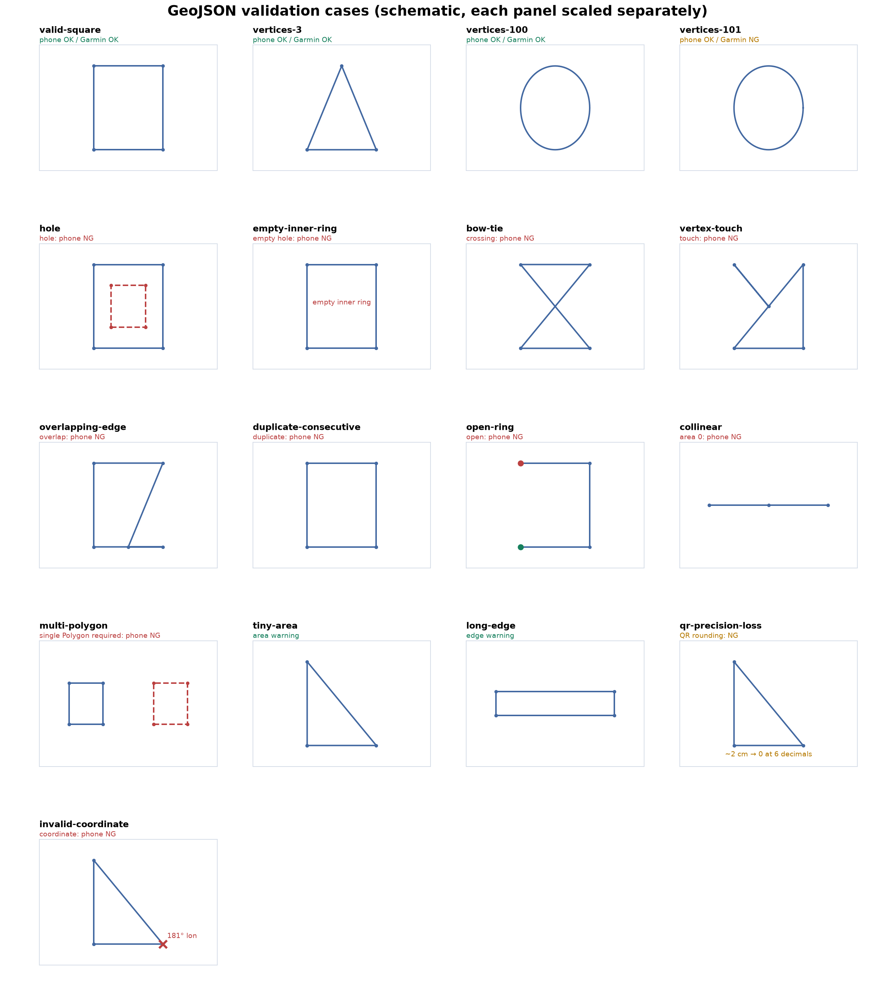

# GeoJSON検証レポート（Issue #102）

2026-09-30。`test/fixtures/geojson_validation/` の17ファイルを共通スマホvalidator、AGZ1生成・復元、Garmin事前validatorへ通した。判定は `test/geo/geojson_validator_test.dart` の実行結果に基づく。

図は形状の模式図で、各枠を別々の縮尺で描いた。青は外周、赤破線は2本目のringまたは2つ目のPolygon。緑の開始点と赤の終点は未閉鎖ring。`invalid-coordinate` の181°点は形が見えるよう図中だけ位置を縮め、値を注記した。元ファイルは変更していない。

| ファイル | 形状・狙い | スマホ | AGZ1生成→復元 | Garmin事前検証 | 主な判定 |
| --- | --- | --- | --- | --- | --- |
| `valid-square` | 閉じた四角形 | 可 | 可 | 可 | 正常 |
| `vertices-3` | 終点を除き3頂点の三角形 | 可 | 可 | 可 | 下限 |
| `vertices-100` | 100頂点の多角形 | 可 | 可 | 可 | Garmin上限 |
| `vertices-101` | 101頂点の多角形 | 可 | 可 | 不可 | `E_TOO_MANY_VERTICES`。QRは作れる |
| `hole` | 内側ringのある四角形 | 不可 | 不可 | 対象外 | `E_HOLES_UNSUPPORTED` |
| `empty-inner-ring` | 2本目が空のring | 不可 | 不可 | 対象外 | `E_HOLES_UNSUPPORTED` |
| `bow-tie` | 辺が交差する蝶ネクタイ形 | 不可 | 不可 | 対象外 | `E_SELF_INTERSECTION` |
| `vertex-touch` | 非隣接辺に頂点が接触 | 不可 | 不可 | 対象外 | `E_SELF_INTERSECTION` |
| `overlapping-edge` | 辺の一部が重なる | 不可 | 不可 | 対象外 | `E_SELF_INTERSECTION` |
| `duplicate-consecutive` | 連続する同一頂点 | 不可 | 不可 | 対象外 | `E_DUPLICATE_CONSECUTIVE_POINT` |
| `open-ring` | 先頭と末尾が異なる | 不可 | 不可 | 対象外 | `E_POLYGON_NOT_CLOSED` |
| `collinear` | 頂点が一直線で面積0 | 不可 | 不可 | 対象外 | `E_ZERO_AREA`、重なりも検出 |
| `multi-polygon` | 離れた2つの四角形 | 不可 | 不可 | 対象外 | `E_SINGLE_FEATURE_POLYGON_REQUIRED`。スマホも単一Polygonのみ |
| `tiny-area` | 100m²未満の三角形 | 可（警告） | 可 | 可 | `W_TINY_AREA` |
| `long-edge` | 50km超の辺を持つ四角形 | 可（警告） | 可 | 可 | `W_LONG_EDGE` |
| `qr-precision-loss` | 約2cmの三角形 | 可（警告） | 不可 | 不可 | 6桁丸めで退化。`W_SHORT_EDGE` も表示 |
| `invalid-coordinate` | 経度181°の頂点 | 不可 | 不可 | 対象外 | `E_INVALID_COORDINATE` |

「対象外」はスマホ用検証で止まりGarminの形状判定へ進まないことを示す。`multi-polygon` はスマホとQRに共通の単一Polygon制約で拒否する。AGZ1以外のQR形式には別の容量制約がある。

## 経路と境界の確認

- 同じ正常GeoJSONをファイル読込、QR生成、QR復元から渡し、スマホ判定が一致することを確認した。
- 17ファイルのAGZ1生成をすべて実行し、生成できた6ファイルは復元後に同じスマホvalidatorで再検証した。
- `qr-precision-loss` は元データのスマホ判定に通るが、QRの小数6桁への丸めで三角形が退化するため生成を拒否した。
- GarminのローカルXYのint16境界内外を別途検証した。101頂点はQRを生成でき、Garmin画面では送信不可、送信クライアント呼出し0回を確認した。
- 穴付きファイルはGarmin画面のファイル選択で拒否され、選択済みコースを置き換えなかった。

## レビュー後の回帰確認

- 小数座標の隣接辺の折り返し、非隣接辺の端点接触、一直線の面積0を検証した。開始頂点と巻き方向を変えた場合も不正な形状を拒否する。丸め誤差の許容幅は入力座標に応じて計算し、約2cmの有効な三角形は引き続きスマホで利用できる。
- 経度 `139.00000051〜139.00001149`、緯度 `35〜35.00005` の細い四角形は、元ファイルでGarmin対応でもAGZ1復元後には非対応になる。生成結果の検証情報を復元後の形状に揃え、画面は「スマホで使えます」と短い理由を表示する。詳細な警告・形式情報は「詳細」に折りたたむ。
- スマホとQRは単一Feature・単一Polygonに統一し、複数FeatureとMultiPolygon（中身が1個でも）は拒否する。外周頂点は閉路の終点を除き1,000点まで。1,000点は許可し、1,001点・50,000点は交差判定へ進む前に上限エラーで拒否する。交差判定自体は同期処理のままで、入力上限により全辺比較の対象を制限する。

- 「QRで復元」のカメラ画面下に「QR画像を選択」を追加。カメラ権限がなくても画像から読み込める。Garmin用の読み込みは元ファイル名を復元し、スマホの監視範囲を変更しない。キャンセル・読み取り失敗時の範囲保持、カメラ復帰とエラー表示も確認した。
- Android E2Eでは生成したAGZ1のPNGをOSの画像解析で読み取り、Garmin転送候補への反映を確認した。ファイル選択とGarmin通信はテスト用に置き換えており、実時計のBLE転送成功を示すものではない。

## 実行結果

| 確認 | 結果 |
| --- | --- |
| ケース集 | `flutter test --no-pub --reporter expanded test/geo/geojson_validator_test.dart`：14件成功（全件実行に含む） |
| 全単体・Widgetテスト | `flutter test --no-pub --reporter expanded`：418件成功 |
| 静的解析 | `flutter analyze --no-pub`：指摘0件 |
| Android E2E全件 | `bash scripts/run_android_e2e.sh emulator-5554`：3ファイル成功（1 / 8 / 8件） |
| iOS E2E全件 | `XCODE_XCCONFIG_FILE=/tmp/argus-pr109-simulator.xcconfig bash scripts/run_ios_e2e.sh ADAC1216-5B9A-4569-8AAD-043BF8EF885A`：同じ3ファイル成功（1 / 8 / 8件） |
| iOS E2E実行スクリプト | `python3 -m unittest discover -s scripts -p 'test_run_ios_e2e.py'`：12件成功 |

E2Eは macOSの `argus_pr_review_api36`（Pixel 7 Pro、arm64-v8a、`emulator-5554`、API 36）で `integration_test/compass_navigation_test.dart`、`integration_test/core_monitoring_e2e_test.dart`、`integration_test/ui_smoke_test.dart` を実行した。`e2e/` ディレクトリはない。`SIMULATOR_GPS=true` などの任意モードは実行していない。テスト用に起動したEmulatorは終了した。

iOSは既存のiPhone 17 Pro Simulator（iOS 26.5、arm64）を使用した。通常のSimulatorビルドはFlutterのフレームワーク準備で複数CPU形式の扱いに失敗したため、一時xcconfigに `ARCHS = arm64` と `ONLY_ACTIVE_ARCH = YES` を指定して全件実行した。リポジトリのビルド設定は変更していない。`mobile_scanner` はiOS Simulatorの画像解析を非対応としているため、画像のケースはエラー表示・範囲保持・戻る操作を確認した。iPhoneの実際の画像解析は別途実機で確認する。AndroidとiPhoneへの通常アプリの更新インストール・起動確認は成功した。

図は `python scripts/plot_geojson_validation_cases.py` で再生成できる。
