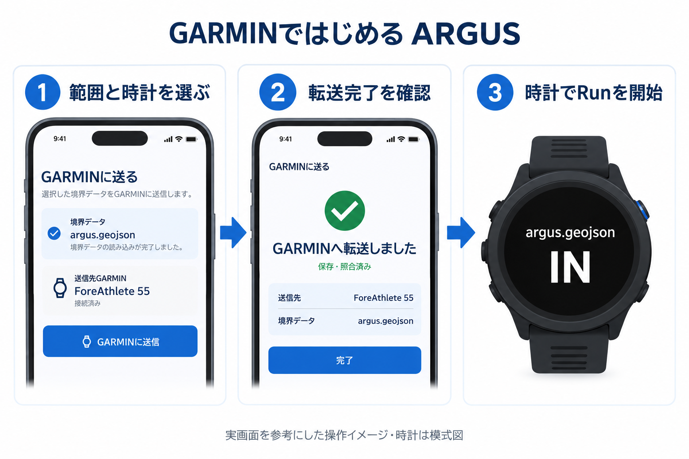
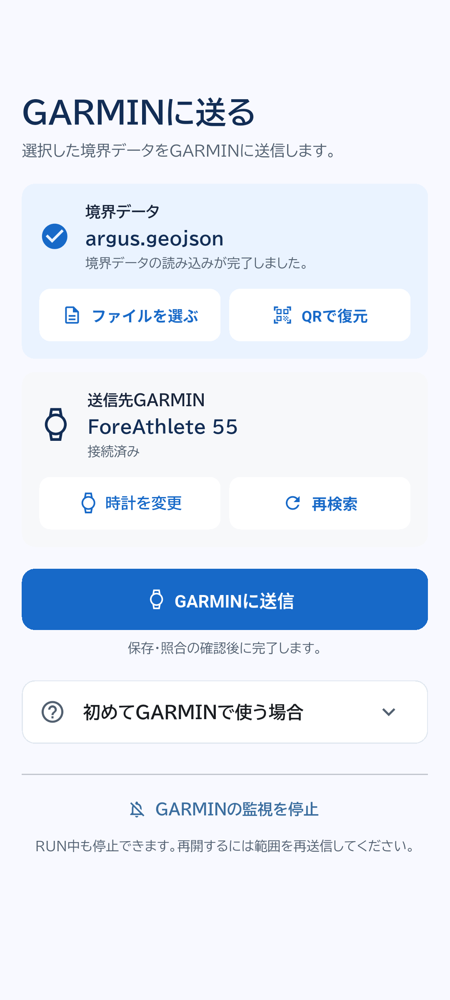
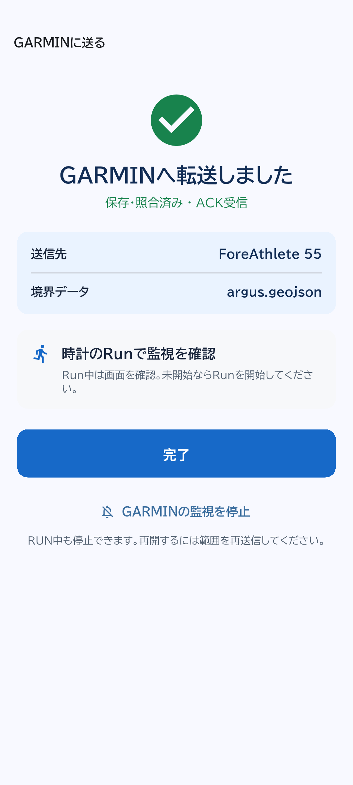
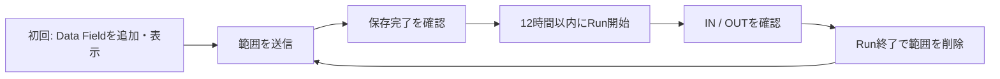

# GARMINではじめるARGUS

スマホから競技エリアを時計へ送り、時計の通常のRunで範囲を監視する試験機能です。範囲を保存した後の判定と警告は、スマホを携帯しなくても時計上で動きます。

上の図はスマホの実画面を参考にGPT Imageで生成しています。時計は模式図です。以下の実UI画像はAndroid E2Eの模擬接続で取得しており、実時計の通信成功を示す証拠ではありません。

## 1. 用意するもの

- ARGUSを入れたスマホと、Garmin Connectにペアリングした対応時計。
- 時計にインストールした**ARGUS Data Field 0.6.0以降**。Data FieldはRunのデータ画面に追加する表示項目です。
- 穴なし・単一Polygon、3〜100頂点のGeoJSONまたはARGUS用QR。
- スマホと時計のBluetooth接続。

登録対象はForerunner 55・165・255・265・945 LTE・955・965とfēnix 6・7・8の指定モデルです。すべての派生モデルや実機を検証済みという意味ではありません。[製品IDと検証状況](../garmin_supported_devices.md)を確認してください。Data Fieldの配布物が手元にない場合は提供者に確認します。公開ストアでの配布状況はこのリポジトリだけでは確定できません。

## 2. 時計側の初回準備

1. Garmin Connectで時計のペアリングと同期を確認します。
2. ARGUS Data Fieldを時計へインストールします。
3. 時計の通常のRunの設定からデータ画面を編集し、ARGUSを追加します。まずは**1項目の画面**で表示を確認してください。メニュー名は機種によって異なります。
4. ARGUSの画面を一度表示します。これでスマホからのバックグラウンド受信が登録されます。
5. 日本語のファイル名・方角を使う場合は、時計の言語を日本語にします。

範囲の転送はRunを開始する前に行います。Run中に新しい範囲へ差し替える使い方は対象外です。

## 3. スマホで範囲と時計を選ぶ

ARGUS起動時に「GARMINだけで利用（試験機能）」→「次へ」を押します。スマホ監視画面の右上メニュー「GARMINに送る」からも開けます。

「ファイルを選ぶ」または「QRで復元」で範囲を選び、「境界データ」のファイル名を確認します。スマホで別の範囲を監視中でも、その監視は継続します。

Androidはペアリング済み時計を検索します。iPhoneは「時計を変更」からGarmin ConnectでARGUSに共有する時計を選び、ARGUSへ戻ります。「再検索」後に、目的の時計名と「接続済み」を確認してください。

## 4. 送信して完了を待つ

「GARMINに送信」を押し、スマホのARGUSを開いたまま待ちます。最大60秒のACK待機があります。ACKは「時計が保存し、内容を照合した」という返事です。

「GARMINへ転送しました」「保存・照合済み」の表示を確認します。送信ボタンを押しただけ、スマホ通知が出なかっただけでは、成功・失敗を判断しないでください。通知未許可でも転送は可能です。

## 5. 時計でRunを開始する

時計で通常のRunを開き、ARGUSのファイル名を確認してRunのタイマーを開始します。GPSが利用可能になると判定します。転送後12時間以内に開始してください。

| 時計の表示 | 意味 |
| --- | --- |
| READY | 範囲がありません。スマホから送信します |
| RECEIVED | 新しい範囲を受信しました。一時的な表示です |
| ARMED | 範囲を保存し、Run開始を待っています |
| GPS WAIT | 測位待ちです |
| IN | 範囲内です |
| CHECKING | 範囲外か再確認しています |
| OUT | 範囲外です。方角と境界までの距離を確認します |
| EXPIRED | Run開始期限切れです。Runを終え、範囲を再送信します |

通常は10秒ごと、範囲外の候補・確定中は2秒ごとに判定します。範囲外を2回かつ2秒以上確認すると、音と振動を3秒鳴らし、1秒休んで繰り返します。再入域も2回確認して解除します。スマホの「3回・10秒」とは別の判定です。

時計の方角は北・東などの**絶対方位**です。スマホの「右を向く」案内と読み方が異なります。地図と周囲の状況も確認してください。

## 6. 終了・再利用する

Run終了時に、そのRunの範囲データを削除して`READY`へ戻ります。一時停止・再開ではデータを保持します。次のRunでは再送信してください。

Runの途中で停止したい場合は、Bluetoothで接続したスマホから「GARMINの監視を停止」を押し、確認画面で「監視を停止」を選びます。削除ACKを確認してから停止完了になります。時計の表示・警告への反映は最大約10秒、再生中の3秒の警告は最後まで続くことがあります。

12時間は**開始期限**です。期限内に始めたRunは、期限をまたいでも終了まで監視します。未開始のまま期限を過ぎても、その時刻に自動削除されるわけではありません。再送信またはスマホからの停止で置き換え・削除できます。

## 困ったとき

| 状況 | 確認すること |
| --- | --- |
| 時計が出てこない | Bluetooth、Garmin Connectとのペアリング、iPhoneの時計共有、再検索 |
| Data Field未導入と表示 | 対応モデルか、インストールが完了したか、Run画面で一度表示したか |
| 送信がタイムアウト | 接続を戻しARGUSを前面にして再送。完了画面と時計のファイル名を確認 |
| 頂点数・サイズのエラー | 単一Polygon・100頂点以内に簡略化。広すぎる範囲は局所座標の制限を超えます |
| 停止が成功しない | Data Fieldを0.6.0以降へ更新し再接続。削除ACKがない間は停止済みと扱いません |
| 日本語が欠ける | 時計の言語を日本語へ変更。長いファイル名は省略される場合があります |
| 次のRunでREADYになる | 1回のRunで消費する仕様です。範囲を再送します |

転送処理自体はクラウドAPIを使いません。Wi-Fi・モバイル通信オフで成功したユーザー報告はありますが、端末条件の詳細は未記録です。現地で初回インストールやペアリングをせず、出発前に使用する組み合わせで確認してください。

次に読む: [対応機種](../garmin_supported_devices.md)、[AGW1とACKの仕様](../garmin_data_format.md)、[時計の開発者向けREADME](../../garmin/argus-data-field/README.md)、[スマホのガイド](phone.md)。
