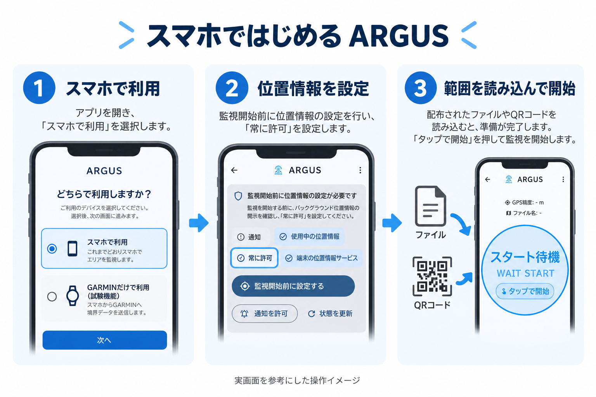
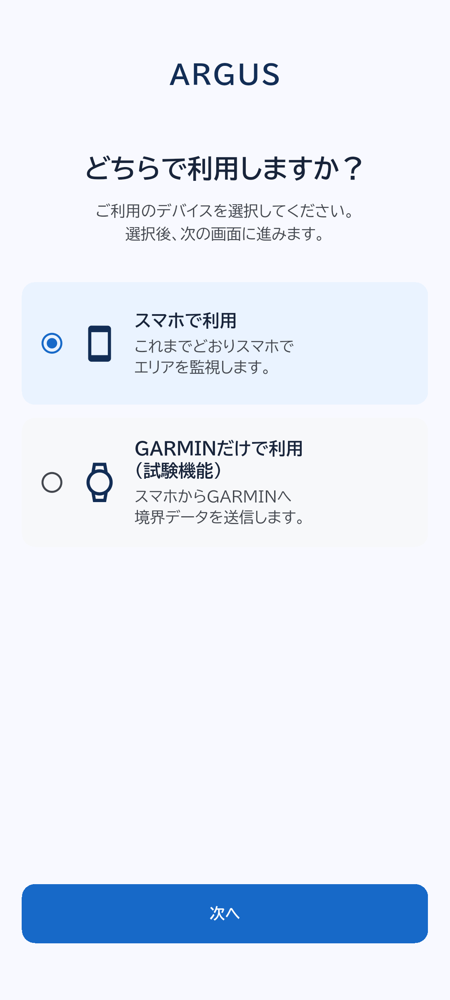
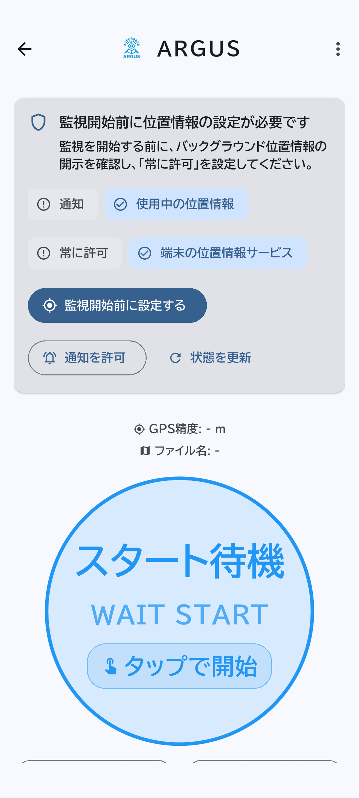
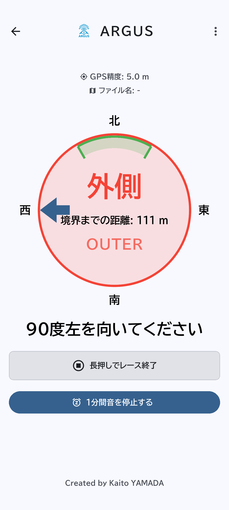
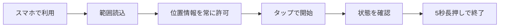

# スマホではじめるARGUS

ARGUSは、主催者などから受け取った競技エリアの範囲をスマホで監視するアプリです。範囲の外に出たと判定すると、音・振動・通知で知らせます。

上の図は実画面を参考にGPT Imageで作成した操作イメージです。以下のスクリーンショットはAndroid E2Eで取得した実UIで、位置・権限はテスト用の値です。OSによって許可画面の表示が異なります。

## 1. 用意するもの

- ARGUSを入れたAndroidスマホまたはiPhone。
- 利用する場所のGeoJSONファイル、ARGUS用QRコード、またはQR画像。
- 充電した端末。屋外で位置情報を受信できる場所。

GeoJSONは「監視する範囲の輪郭」を記録したファイルです。一般のURLのQRコードは使えません。ARGUSの`agz1:`または`gjz1:`形式を使います。スマホもQR生成と同じ単一Feature・単一Polygonのみを受け付け、外周の頂点は閉路の終点を除いて最大1,000点です。複数の範囲、MultiPolygon、穴のあるエリア、自己交差した輪郭は読み込めません。主催者に修正した範囲データを用意してもらってください。[画像で見る対応条件](../geojson_validation.md)も参照してください。

## 2. スマホモードを選ぶ

起動したら「スマホで利用」を選び、「次へ」を押します。起動時はこの選択が初期値です。

## 3. 範囲を読み込む

ホーム画面下部の「ファイルを読み込む」から「GeoJSONファイルを読み込む」を選びます。QR画像を受け取った場合は同じメニューの「QRコード画像を読み込む」を選びます。

紙や別の端末のQRをカメラで読む場合は「QRコードを読み込む」を押し、カメラの使用を許可します。読込後、ファイル名と「スタート待機」が表示されることを確認してください。

画面のファイル名は最後のピリオドとそれ以降を省略します。例えば `公園.v2.geojson` は `公園.v2` と表示されます。元ファイルやQRに含まれるファイル名は変わりません。本ガイドの画像には変更前の拡張子付き表示が含まれます。

## 4. 位置情報と通知を設定する

「監視開始前に設定する」を押し、バックグラウンド位置情報の説明を読みます。Androidは「同意して位置情報の設定へ進む」、iPhoneは「続ける」からOSの許可へ進みます。

位置情報は使用中の許可に続いて「常に許可」を設定し、端末の位置情報サービスもオンにします。戻っても案内が残る場合は「状態を更新」を押してください。iPhoneで拒否した後は、カードの「アプリ設定を開く」から設定を変更します。

通知も許可すると、画面を見ていないときに警告を確認できます。通知の拒否だけで監視開始が禁止されることはありません。

## 5. 監視を開始する

円形表示の「タップで開始」を押します。Androidで音量の案内が出たら「音設定を開く」で**アラーム音量を50%以上**にして「再確認」を押します。メディア音量とは別の設定です。

iPhoneでは、右上メニューの「設定」から「警告音をテスト」で聞こえ方を確認できます。「テストを停止」で止めてから利用してください。

| 表示 | 意味と操作 |
| --- | --- |
| GeoJSON待機 / WAIT GEOJSON | 先に範囲を読み込みます |
| スタート待機 / WAIT START | 開始ボタンを押す前の状態です |
| 内側 / INNER | 範囲内と判定しています |
| 近接 / NEAR | 設定した境界バッファ内です。既定のバッファは0mです |
| 外側待機 / OUTER PENDING | 範囲外を再確認しています |
| 外側 / OUTER | 範囲外が確定し、警告しています |
| GPS不良 / GPS BAD | 測位精度が不足しています。空が開けた場所で再確認します |

既定では、範囲外の測位が連続3回かつ最初の範囲外測位から10秒続くと警告します。位置更新の都合で、必ず10秒ちょうどで鳴るとは限りません。

## 6. 警告が出たら

周囲と競技の地図を確認し、範囲内へ戻ります。コンパスの矢印は境界へ戻る方向の目安で、通行可能な経路を保証する案内ではありません。

「1分間音を停止する」は音・振動を一時停止します。監視と範囲外表示は続き、範囲外のまま1分たつと警告を再開します。範囲内へ復帰すると警告を解除します。

## 7. 終了する

「長押しでレース終了」を**5秒間**押し、スタート待機へ戻ったことを確認します。画面を消すだけでは終了しません。アプリが終了した後、次回起動時に監視が自動再開することはありません。

## 困ったとき

| 状況 | 確認すること |
| --- | --- |
| 開始できない | 範囲の読込、位置サービス、常に許可、Androidのアラーム音量 |
| QRが読めない | ARGUS用か、カメラ許可、明るさ、QR全体が入る距離。画像ならファイル読込も使えます |
| ファイルが不正と表示される | GeoJSONの座標は経度・緯度の順。緯度±90、経度±180以内の数値が必要です |
| GPS不良になる | 屋内・高い建物・樹木などの影響を避け、端末側の測位を確認します |
| 画面を消すと使えない | 常に許可とOSの省電力設定を確認し、利用前に実機で試します |

次に読む: [GARMINのガイド](garmin.md)、[QRの仕様](../geojson_to_qr.md)、[詳細仕様](../spec.md)。
