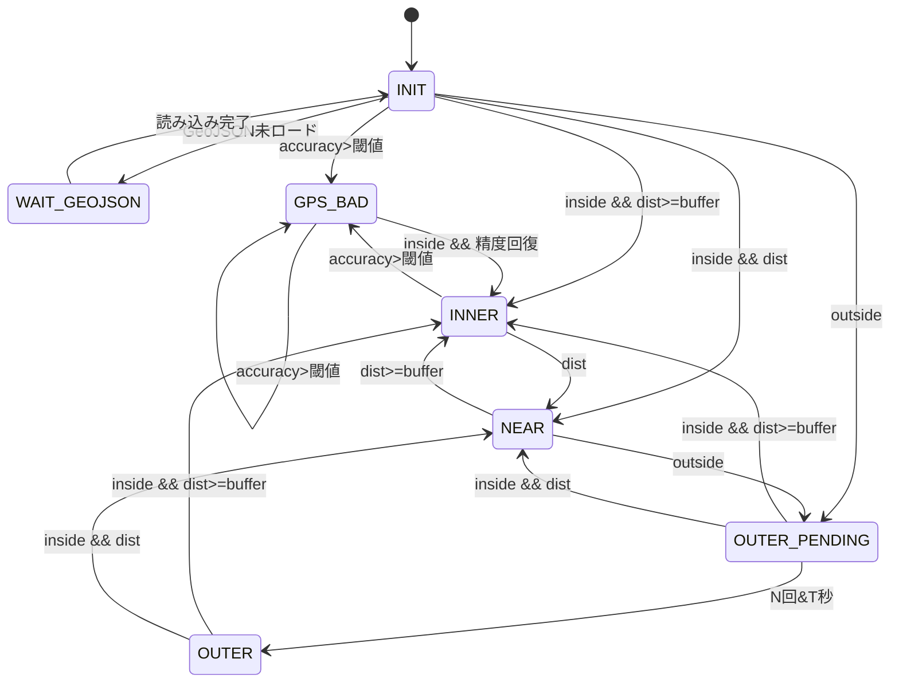
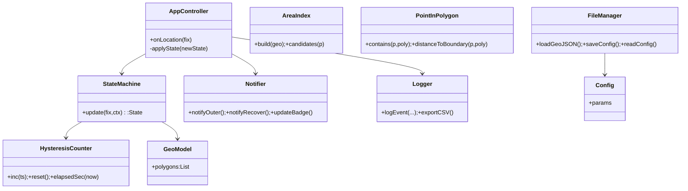

# Argus（アルゴス） — 競技エリア逸脱検知アプリ 要件完全版（Codex用）

本書はアプリ開発者がこのまま設計・実装・テスト・運用まで進められる完全版の要件定義書。v3で示した技術構成・状態遷移・クラス設計を統合し、プロジェクト計画・非機能・リスク・試験・運用項目まで包含する。

---

## 0. 概要

* **名称**：Argus（アルゴス）
* **目的**：競技者の位置が事前定義エリア(GeoJSON)外に出た場合のみ、確実かつ低電力で警告を出す。
* **成果物**：モバイルアプリ(Android/iOS)、GeoJSON仕様書、試験・運用ドキュメント。
* **対象利用者**：オリエンテーリング・ロゲイニング・トレイル大会の参加者および主催者。

---

## 1. 利害関係者と責任分担

| 役割               | 主な責務                         |
| ------------------ | -------------------------------- |
| プロダクトオーナー | 要件確定・優先順位設定・最終承認 |
| テックリード       | 設計整合性・アーキテクチャ審査   |
| 開発チーム         | 実装・単体/結合テスト            |
| 主催者             | GeoJSON作成と当日運用            |
| QA                 | 試験計画・結果記録・受入確認     |

---

## 2. スコープ定義

### 対象（IN）

* 逸脱判定（内/近傍/外）
* GeoJSON読込/検証
* バッファ距離による誤警告防止
* バイブ/音/全画面通知
* ローカルログ保存・エクスポート

### 非対象（OUT）

* 通信を要するSOS通報
* クラウド同期
* ナビゲーション誘導

---

## 3. 用語定義

* **エリア**：Polygon/MultiPolygonで定義される競技範囲。
* **境界距離(dist)**：現在地から境界線までの最短距離。
* **ヒステリシス**：外確定までに設ける遅延条件（連続N回＆T秒）。
* **NEAR**：境界近傍(距離<inner_buffer_m)。

---

## 4. 前提条件と制約

* 対応OS：Android9+/iOS15+
* 通信不要(完全オフライン)
* 測位誤差を考慮しGPS_BAD状態を設ける。
* 法的：警告補助ツールであり安全を保証しない。

---

## 5. 機能要件（FR）

1. 位置監視(省電力) - 速度別間隔制御
2. GeoJSON読込/検証 - 座標順,CRSチェック
3. 内外判定 - R-tree + point-in-polygon
4. 境界距離算出 - 境界線分への最短距離
5. ヒステリシス判定 - N回&T秒で確定
6. 状態遷移 - INNER/NEAR/OUTER_PENDING/OUTER/GPS_BAD
7. 通知 - OUTER確定で強通知、復帰で解除通知
8. ログ - JSONL/CSVで記録、30日保持
9. 設定管理 - config.jsonでパラメータ保存
10. 権限制御 - 位置・通知・前景サービス権限要求

---

## 6. 非機能要件（NFR）

* 性能：1処理<10ms
* 電池：8h稼働で消費≤20%
* 安定性：クラッシュ率<0.1%
* 可用性：起動成功率>99%
* アクセシビリティ：強バイブ/大文字表示
* セキュリティ：位置情報外送信なし

---

## 7. データ仕様

### GeoJSON

* CRS: EPSG:4326
* Geometry: PolygonまたはMultiPolygon
* 必須プロパティ: name, version
* 品質条件: 自己交差なし・閉ループ

### Config JSON

```json
{
  "inner_buffer_m": 30,
  "leave_confirm_samples": 3,
  "leave_confirm_seconds": 10,
  "gps_accuracy_bad_m": 40,
  "sample_interval_s": {"slow":15,"normal":8,"fast":3},
  "sample_distance_m": {"slow":25,"normal":15,"fast":8},
  "screen_wake_on_leave": true,
  "log_enabled": true
}
```

### ログ CSV

```
timestamp,lat,lon,status,dist_to_boundary_m,horiz_accuracy_m,battery_pct
```

---

## 8. 状態遷移図（Mermaid）



---

## 9. クラス図（Mermaid）



---

## 10. 実装パターン

* StateMachineは副作用を持たず、入力→出力を返す純粋関数。
* AppControllerは通知・ログの副作用層。
* GeoModelとPointInPolygonを分離し再利用性を確保。

### 擬似コード

```pseudo
onLocation(fix):
  newState=sm.update(fix,ctx)
  if newState!=sm.current:
    notifier.updateBadge(newState)
    if newState==OUTER: notifier.notifyOuter()
    if sm.current==OUTER and newState!=OUTER: notifier.notifyRecover()
    logger.logEvent(...)
  sm.current=newState
```

---

## 11. テスト計画・受入基準

* 精度悪化→保留→復帰動作。
* 境界沿い移動時に誤警告0。
* 外逸脱10秒以内通知、復帰即解除。
* 8h連続稼働でクラッシュ0、電池消費≤20%。

---

## 12. 運用とリスク管理

* エリア配布: 主催者がAirDrop等で事前転送。
* 権限チェック: 起動時に自動確認。
* リスク例: GPS劣化→NEAR保留; 電池最適化→前景サービス強制。

---

## 13. 拡張計画

* v1.1: MultiPolygon対応・地図表示追加。
* v1.2: 外滞在時間・方向ガイド。
* v1.3: ジオフェンス事前コンパイル形式。

---

## 14. アーキテクチャ思想まとめ

* フェイルセーフ：誤報を減らし見逃しゼロを優先。
* 責務分離：純粋ロジックと副作用を分離。
* テスト容易性：StateMachine単体でユニットテスト可能。
* 将来拡張性：GeoJSONやUIを独立進化可能。

---

## 15. 技術スタックと言語（Flutter）

* **言語/フレームワーク**：Flutter 3.x + **Dart**
* **理由**：単一コードベースでAndroid/iOS同等品質。オフライン前提・軽量UI・センサーI/Oが安定。
* **主要パッケージ**：

  * 位置: `geolocator`
  * 前景/バックグラウンド: `workmanager`
  * ファイルピッカー: `file_picker`
  * JSON: `json_annotation` + `build_runner`
  * ログ: `logger`
* **コード規約**：`dart format`、`flutter_lints`
* **テスト**：`flutter_test`、状態機械のユニットテスト必須
* **ビルド**：`flutter build apk` / `flutter build ipa`
* **ディレクトリ例**：

```
lib/
  app_controller.dart
  state_machine/
    state.dart
    hysteresis_counter.dart
  geo/
    geo_model.dart
    area_index.dart
    point_in_polygon.dart
  io/
    file_manager.dart
    logger.dart
  platform/
    location_service.dart
    notifier.dart
  ui/
    home_page.dart
    settings_page.dart
assets/
  geojson/
  config/
```

---

## 16. コード生成ガイド（Codex向け）

* 「Flutter/Dartで、上記ディレクトリ構成・クラス図に沿って、`StateMachine.update`と`AppController.onLocation`を実装。`State`はenum、ヒステリシスは`HysteresisCounter`クラスで管理。`PointInPolygon.contains`はray casting、`distanceToBoundary`は線分最近傍で計算。ユニットテストを`test/state_machine_test.dart`に生成。」

---

## 17. 権限・設定テンプレ

### Android Manifest（抜粋）

```xml
<uses-permission android:name="android.permission.ACCESS_FINE_LOCATION"/>
<uses-permission android:name="android.permission.FOREGROUND_SERVICE"/>
<uses-permission android:name="android.permission.POST_NOTIFICATIONS"/>
```

### iOS Info.plist（抜粋）

```xml
<key>NSLocationAlwaysAndWhenInUseUsageDescription</key>
<string>競技エリア逸脱の検知に位置情報を使用します。</string>
<key>UIBackgroundModes</key>
<array><string>location</string></array>
```

---

## 18. 受入チェックリスト

* 仕様準拠：FR/NFR/KPIに対応する実装/試験項目が存在
* 端末検証：Android実機2台以上、iOS実機1台以上
* テスト：StateMachineユニット100%カバレッジ、フィールド試験ログ提出
* ストア要件：プライバシー文言・権限説明の整備

---

## 19. 付録

* A) 疑似データ：モック位置ストリームCSV仕様
* B) GeoJSON検証コマンド例（`geojsonlint`/`ogrinfo`）
* C) エラー文言標準（日本語/英語）

この更新で、Argus（アルゴス）はFlutter/Dart専用アプリとして確定し、言語・ツールチェーン・ビルド/テスト手順まで明文化された。
