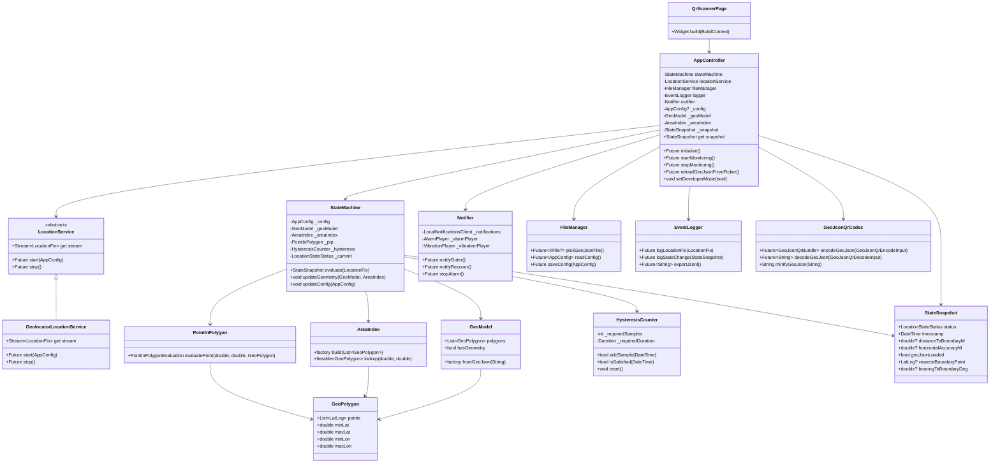
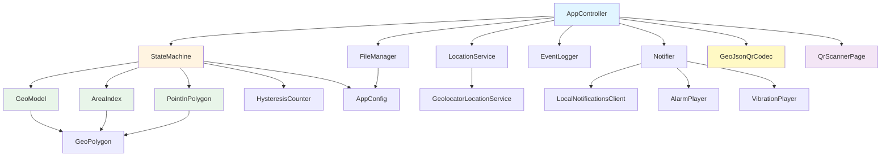
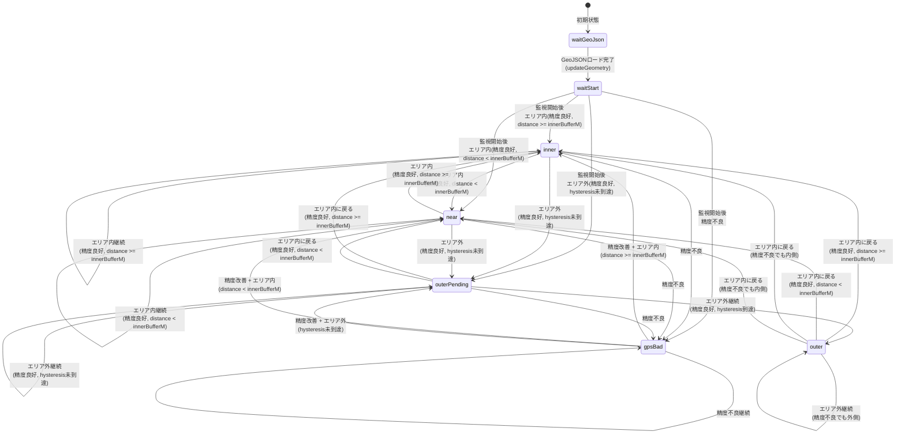

# Argus 仕様書 v6（2025-01-XX 時点）

本ドキュメントは Flutter 製アプリ Argus の現行コード（ブランチ `easy-navigation`）をもとに構成・挙動・テスト観点を整理したものです。コードベースを深く解析し、実装に基づいた正確な仕様を記載しています。

---

## 0. 概要

- **目的**: GeoJSON で定義した警戒エリアからの逸脱を端末上で監視し、離脱時に即時アラートを発報する。OUTER状態時には復帰のための距離・方位情報を提供する。
- **利用想定**: 保護対象者の無断外出検知、現場作業者の安全区域逸脱監視、競技エリア監視など。
- **対応プラットフォーム**: Flutter 3.x / Dart 3.2+。Android 9 以降、iOS 15 以降を想定。
- **位置取得**: Geolocator を利用し、最短 3 秒間隔・距離フィルタ 0m で継続的に測位。Android では Foreground Service、iOS では常時位置情報を前提。

---

## 1. 機能要件

### 1.1 GeoJSON 読み込み

- **初回起動**: `assets/geojson/sample_area.geojson` をバンドルロードを試行。失敗時はエラーログを記録し、`waitGeoJson` 状態を維持。
- **ファイルピッカー**: ユーザは FloatingActionButton（「Load GeoJSON」ラベル）またはファイルピッカーで `.geojson` / `.json` を再ロード可能。
- **QRコード読み込み**: ユーザは FloatingActionButton（「Read QR code」ラベル）でQRコードをスキャンし、GeoJSONを読み込むことが可能。QRコードは `gjb1:` スキームで始まる必要がある。読み込んだGeoJSONは一時ファイルとして保存され、アプリ終了時に自動削除される。
- **ファイル名処理**: 読み込んだファイル名は `.geojson` 拡張子に正規化され、UI に表示される。QRコードから読み込んだ場合は `temp_geojson_<timestamp>.geojson` という名前で一時ファイルとして保存される。
- **エラー処理**: 読み込み失敗はエラーバナーとログ（レベル ERROR）で通知。`FormatException` とその他の例外を区別して表示。QRコードの形式が無効な場合やデコードに失敗した場合も適切にエラーを表示する。

### 1.2 位置情報ストリーム

- **Geolocator 設定**: `getPositionStream` を利用。
  - **サンプリング間隔**: `AppConfig.sampleIntervalS['fast']` を優先使用。存在しない場合は最小値を選択。デフォルトは 3 秒。
  - **距離フィルタ**: 0m（すべての位置更新を受信）。
- **Android 設定**:
  - `AndroidSettings` を使用
  - `accuracy: LocationAccuracy.best`
  - `forceLocationManager: false`
  - `ForegroundNotificationConfig` で通知を表示（タイトル: 「Argusが位置情報を監視中です」、本文: 「画面を消しても位置情報の追跡は継続されます。」）
  - `enableWakeLock: true`, `setOngoing: true`
- **iOS/macOS 設定**:
  - `AppleSettings` を使用
  - `accuracy: LocationAccuracy.best`
  - `pauseLocationUpdatesAutomatically: false`
  - `showBackgroundLocationIndicator: true`
- **権限確認**: `start()` 時に `LocationPermission.always` を要求。`whileInUse` のみ許可されている場合は設定画面を開く。

### 1.3 状態遷移ロジック

- **状態機械**: `StateMachine` が GeoJSON と設定値（閾値）を参照し、位置情報を評価して状態を算出。
- **状態一覧**:
  - `waitGeoJson`: GeoJSON 未ロード。ユーザにロード操作を促す。
  - `waitStart`: 監視準備完了。位置ストリームは未開始。スタートボタンを待っている状態。
  - `inner`: エリア内かつバッファより十分内側（`distanceToBoundaryM >= innerBufferM`）。
  - `near`: エリア内だがバッファ距離未満（`distanceToBoundaryM < innerBufferM`）。
  - `outerPending`: エリア外候補。ヒステリシス確定待ち。
  - `outer`: エリア外確定。通知・アラーム発火。
  - `gpsBad`: 位置精度不足（`accuracyMeters > gpsAccuracyBadMeters`）。ただし、OUTER 状態時は特別処理（後述）。
- **判定フロー**:
  1. GeoJSON 未ロード → `waitGeoJson`
  2. 精度不良チェック: `accuracyMeters == null || accuracyMeters > gpsAccuracyBadMeters`
     - OUTER 状態でない場合: `gpsBad` に遷移し、ヒステリシスをリセット
     - OUTER 状態の場合: 内側に戻ったかどうかを判定。内側なら `inner`/`near` に即座に遷移（ヒステリシスリセット）。外側なら OUTER を維持し、距離情報を最善努力で提供
  3. 精度良好の場合: エリア内/外を判定
     - エリア内: `inner`/`near`（距離に応じて）に遷移、ヒステリシスリセット
     - エリア外: ヒステリシスカウンタを更新。条件を満たせば `outer`、満たさなければ `outerPending`
- **ヒステリシス**: OUTER 確定には `leaveConfirmSamples` 回の連続サンプル AND `leaveConfirmSeconds` 秒の経過が必要。内側に戻ると即座にリセット。
- **空間インデックス**: `AreaIndex` がポリゴンの境界ボックスを使用して候補ポリゴンを絞り込み、評価対象を最適化。

### 1.4 点とポリゴンの判定

- **包含判定**: Ray Casting アルゴリズムを使用。ポリゴンの各辺との交差をカウントして内外を判定。
- **距離計算**: ポリゴンの各辺から最近接点を計算し、Haversine 公式で距離を算出（単位: メートル）。
- **方位角計算**: 現在位置から最寄り境界点への方位角を計算（0-360度、北が0度）。
- **最寄り境界点**: ポリゴン境界上の最近接点の座標を保持。

### 1.5 バックグラウンド動作

- **Android**: 位置サービスは Foreground Service として継続。`WAKE_LOCK` / `FOREGROUND_SERVICE_LOCATION` 権限を要求。
- **iOS**: Info.plist で `location` 背景モードを有効化し、Always 許可を促す文言を日本語で表示。

### 1.6 通知とアラーム

- **通知チャンネル**: `Argus警告`（ID: `argus_alerts`）。説明は「ジオフェンスの安全エリアから離れたときに通知します。」。
- **通知初期化**:
  - **Android**: `AndroidInitializationSettings` でアイコン（`@mipmap/ic_launcher`）を設定
  - **iOS**: `DarwinInitializationSettings` で権限要求を設定（`requestAlertPermission: true`, `requestBadgePermission: true`, `requestSoundPermission: true`, `requestCriticalPermission: true`）
- **通知内容**: OUTER 状態への遷移時に通知を表示
  - タイトル: `Argus警告`
  - 本文: `競技エリアから離れています。`（実装では「競技エリア」と記載）
  - **Android**: `Importance.max`, `Priority.max`, `fullScreenIntent: true`, `category: AndroidNotificationCategory.alarm`
  - **iOS**: `presentAlert: true`, `presentSound: true`, `interruptionLevel: InterruptionLevel.critical`
- **Foreground Service 通知（Android）**: 背景計測用に「Argusが位置情報を監視中です」「画面を消しても位置情報の追跡は継続されます。」を表示。
- **バックグラウンド位置情報表示（iOS）**: `showBackgroundLocationIndicator: true` により、バックグラウンドで位置情報を取得中であることをステータスバーに表示。
- **アラーム音**: `flutter_ringtone_player` によるループ再生（`looping: true`, `volume: 1.0`, `asAlarm: true`）。`Notifier.stopAlarm()` で停止。
- **復帰通知**: INNER/NEAR 復帰時に通知をキャンセルし、アラームを停止。
- **権限要求**: 初期化時に通知権限を要求（`alert`, `badge`, `sound`, `critical`）。Android と iOS の両方で適切な権限要求メソッドを呼び出す。

### 1.7 退避ナビゲーション

- **表示条件**: OUTER 状態時、または開発者モード有効時
- **表示情報**:
  - 境界までの距離（メートル）
  - 方角（度 + 方位記号: N, NE, E, SE, S, SW, W, NW）
  - 最寄り境界点の座標（緯度、経度）
- **計算方法**: `PointInPolygon` が最寄り境界点を計算し、Haversine 公式で距離を算出、方位角を計算。
- **ログ/通知**: OUTER 状態への遷移時にログにナビゲーションヒントを追加（例: "Move 50m toward N (0deg) heading to lat=35.12345, lon=139.67890."）。

### 1.8 UI

#### HomePage

- **AppBar**: タイトル Argus、Settings への遷移アイコン。
- **Body**:
  1. **状態バッジ**: 大きな円形バッジ（画面幅の70%）で状態を表示。状態別カラー（inner: 緑、near: オレンジ、outerPending: 深オレンジ、outer: 赤、gpsBad: グレー、waitGeoJson: 青灰、waitStart: 青）。`waitStart` 状態ではタップ可能で START ボタンとして機能。
  2. **GeoJSON ファイル状態**: ロード済み/未ロードの表示。ロード済みの場合はファイル名を表示。
  3. **退避ナビゲーション**: OUTER 状態時または開発者モード時に距離・方角を表示。
  4. **開発者モード情報**: 開発者モード有効時のみ表示
     - 現在の状態名
     - Notes（あれば）
     - 最終更新時刻
     - 境界までの距離・方角・最寄り境界点座標
     - 位置精度
     - GeoJSON ロード状態
     - エラーメッセージ（あれば）
     - ログエントリ（最新5件）
  5. **エラーメッセージ**: 開発者モードに関わらず表示可能。
- **FAB**: `GeoJSON` ボタン（ファイルピッカーを開く）。

#### SettingsPage

- **設定値表示**: 現在の設定値をテキスト表示
  - Inner buffer (m)
  - Leave confirm (samples / seconds)
  - GPS bad threshold (m)
- **Developer mode switch**: 距離/方位の詳細情報を常時表示するかどうかを切り替え。デフォルトは OFF。
- **Export logs ボタン**: JSON 形式でログをエクスポートし、ダイアログで表示。ユーザが手動でコピーする運用。

---

## 2. 非機能要件

- **パフォーマンス**: 位置取得・状態評価・ログ記録はいずれも非同期処理で UI スレッドを阻害しない。`AreaIndex` による空間インデックスで評価対象ポリゴンを絞り込み。
- **電力消費**: Android は WakeLock を活用しつつも位置リクエスト間隔は設定値で調整可能。iOS はバックグラウンド許可前提。
- **データ永続化**: 設定はアプリドキュメントディレクトリの `config.json` に保存。存在しない場合はデフォルト設定をロード。ログはメモリのみで保持し、最大 200 件のリングバッファ管理（`AppController._logs`）。
- **権限**: 初期化時に通知・位置情報（常時）許可を順序立てて要求。拒否時はアプリ設定画面への誘導。
- **ローカライズ**: 通知文言、位置許可文言、UI 文言は日本語がデフォルト。

---

## 3. アーキテクチャと構造

### 3.1 アーキテクチャ概要

Argusアプリケーションは、依存性注入パターンと抽象化を活用したクリーンアーキテクチャを採用しています。

#### 主要な設計原則

1. **依存性注入**: すべてのプラットフォーム固有の実装は、抽象クラスを通じてアクセスされます。これにより、テスト容易性と保守性が向上します。
2. **単一責任の原則**: 各クラスは明確な責任を持ち、1つのことを行います。
3. **不変性の推奨**: 可能な限り`final`を使用し、状態の変更を明示的にします。
4. **非同期処理**: `async/await`を使用して、UIスレッドを阻害しない非同期処理を実装します。

#### レイヤー構造

```
┌─────────────────────────────────────┐
│         UI Layer (Flutter)          │
│  HomePage, SettingsPage, etc.       │
└──────────────┬──────────────────────┘
               │
┌──────────────▼──────────────────────┐
│      Application Layer              │
│      AppController                  │
│  (ChangeNotifier, State Management) │
└──────────────┬──────────────────────┘
               │
┌──────────────▼──────────────────────┐
│      Domain Layer                   │
│  StateMachine, GeoModel, etc.       │
└──────────────┬──────────────────────┘
               │
┌──────────────▼──────────────────────┐
│      Platform Layer                 │
│  LocationService, Notifier, etc.    │
│  (Abstract Interfaces)              │
└─────────────────────────────────────┘
```

### 3.2 クラス図と依存関係

#### 主要クラスの関係

```
AppController
├── StateMachine (状態管理)
│   ├── GeoModel (GeoJSONデータ)
│   ├── AreaIndex (空間インデックス)
│   ├── PointInPolygon (内外判定)
│   └── HysteresisCounter (ヒステリシス)
├── LocationService (位置情報取得)
│   └── GeolocatorLocationService (実装)
├── Notifier (通知・アラーム)
│   ├── LocalNotificationsClient (抽象)
│   ├── AlarmPlayer (抽象)
│   └── VibrationPlayer (抽象)
├── FileManager (ファイル操作)
├── EventLogger (ログ記録)
└── GeoJsonQrCodec (QRコード処理)
```

#### 依存関係の方向

- **AppController** → すべての主要コンポーネント（依存性注入）
- **StateMachine** → GeoModel, AreaIndex, PointInPolygon, HysteresisCounter
- **Notifier** → LocalNotificationsClient, AlarmPlayer, VibrationPlayer（抽象クラス）
- **LocationService** → プラットフォーム固有の実装（抽象クラス）

### 3.3 状態遷移図

```
                    [waitGeoJson]
                         │
                         │ GeoJSON読み込み
                         ▼
                    [waitStart]
                         │
                         │ 監視開始
                         ▼
                    ┌────┴────┐
                    │         │
              [inner]    [near]
                    │         │
                    └────┬────┘
                         │
                         │ エリア外
                         ▼
                 [outerPending]
                         │
                         │ ヒステリシス条件満たす
                         ▼
                    [outer]
                         │
                         │ エリア内復帰
                         ▼
                    [inner/near]

        精度不良時:
        [任意の状態] → [gpsBad]
                         │
                         │ 精度改善
                         ▼
                    [inner/near/outerPending]
```

### 3.4 プロジェクト構造

### 3.4.1 ディレクトリ構成

```
lib/
├── main.dart                    # アプリケーションエントリーポイント
├── app_controller.dart          # アプリケーション全体の状態管理とコーディネーション
├── geo/                         # 地理空間データ処理
│   ├── geo_model.dart          # GeoJSONパースとGeoModel/GeoPolygon/LatLng定義
│   ├── area_index.dart         # 空間インデックス（境界ボックスによる高速検索）
│   └── point_in_polygon.dart   # 点とポリゴンの包含判定・距離・方位角計算
├── state_machine/              # 状態機械
│   ├── state.dart              # LocationStateStatus enum, StateSnapshot定義
│   ├── state_machine.dart      # 状態遷移ロジックと評価処理
│   └── hysteresis_counter.dart # ヒステリシスカウンタ（OUTER確定のための条件管理）
├── platform/                    # プラットフォーム固有機能
│   ├── location_service.dart  # 位置情報サービス（Geolocator抽象化）
│   └── notifier.dart          # 通知・アラーム制御
├── qr/                         # QRコード機能
│   └── geojson_qr_codec.dart  # GeoJSONとQRコードの相互変換（Brotli圧縮、Base64URLエンコード）
├── io/                         # ファイルI/Oと設定管理
│   ├── config.dart            # AppConfig定義とJSONシリアライゼーション
│   ├── file_manager.dart      # 設定ファイル・GeoJSONファイルの読み書き
│   ├── logger.dart            # EventLogger（GPS・状態イベントの記録）
│   └── log_entry.dart         # AppLogEntry/AppLogLevel定義
└── ui/                         # ユーザーインターフェース
    ├── home_page.dart         # メイン画面（状態表示、ナビゲーション情報）
    ├── settings_page.dart      # 設定画面（パラメータ調整、開発者モード）
    └── qr_scanner_page.dart    # QRコードスキャン画面（カメラを使用したQRコード読み取り）
```

### 3.2 アーキテクチャ概要

| 区分             | 主要クラス                                                                     | 役割                                                                                            |
| ---------------- | ------------------------------------------------------------------------------ | ----------------------------------------------------------------------------------------------- |
| 中核ロジック     | `AppController`                                                                | アプリ全体の状態管理、位置ストリームの購読、ログ記録、通知制御、QRコードからのGeoJSON読み込み。 |
| 状態機械         | `StateMachine`, `StateSnapshot`, `LocationStateStatus`                         | 位置評価と状態管理、ヒステリシス処理。                                                          |
| ジオメトリ       | `GeoModel`, `GeoPolygon`, `LatLng`                                             | GeoJSON パース、ポリゴンデータの保持。                                                          |
| 空間インデックス | `AreaIndex`                                                                    | ポリゴンの境界ボックスによる空間インデックス。位置に基づいて候補ポリゴンを絞り込み。            |
| 点とポリゴン判定 | `PointInPolygon`, `PointInPolygonEvaluation`                                   | Ray Casting による包含判定、最近接点・距離・方位角の計算。                                      |
| QRコード         | `GeoJsonQrCodec`, `encodeGeoJson`, `decodeGeoJson`                             | GeoJSONのBrotli圧縮、Base64URLエンコード、QRコード生成・復元。                                  |
| 位置サービス     | `LocationService`, `GeolocatorLocationService`, `LocationFix`                  | 位置ストリームの開始・停止、権限確認、プラットフォーム固有設定。                                |
| 通知             | `Notifier`, `AlarmPlayer`（`RingtoneAlarmPlayer`）, `LocalNotificationsClient` | 通知チャンネル作成、アラーム音制御、バッジ状態。                                                |
| ログ             | `EventLogger`, `AppLogEntry`, `AppLogLevel`                                    | GPS・状態イベントのメモリ記録と UI 連携、JSON エクスポート。                                    |
| I/O              | `FileManager`, `AppConfig`                                                     | 設定・GeoJSON ファイルの読み書き、ファイルピッカー。                                            |
| UI               | `HomePage`, `SettingsPage`, `QrScannerPage`, `ArgusApp`                        | 画面構成とユーザ操作ルーティング。                                                              |

### 3.3 データフロー

1. **初期化**: `main()` → `AppController.bootstrap()` → 各サービス初期化
2. **GeoJSON読み込み（ファイルピッカー）**: `FileManager.pickGeoJsonFile()` → `GeoModel.fromGeoJson()` → `AreaIndex.build()` → `StateMachine.updateGeometry()`
3. **GeoJSON読み込み（QRコード）**: `QrScannerPage` → `AppController.reloadGeoJsonFromQr()` → `decodeGeoJson()` → 一時ファイル保存 → `GeoModel.fromGeoJson()` → `AreaIndex.build()` → `StateMachine.updateGeometry()`
4. **位置監視**: `LocationService.stream` → `AppController._handleFix()` → `StateMachine.evaluate()` → `Notifier`更新
5. **状態表示**: `AppController.snapshot` → `HomePage`（リアクティブ更新）
6. **アプリ終了時**: `WidgetsBindingObserver.didChangeAppLifecycleState()` → `AppController.cleanupTempGeoJsonFile()` → 一時ファイル削除

### 3.4 依存関係

- **AppController** ← StateMachine, LocationService, FileManager, EventLogger, Notifier, GeoJsonQrCodec
- **StateMachine** ← GeoModel, AreaIndex, PointInPolygon, AppConfig, HysteresisCounter
- **GeoModel** ← GeoJSON（パース）
- **PointInPolygon** ← 地理計算（Haversine公式など）
- **GeoJsonQrCodec** ← Brotli（CLI）、Base64URL、SHA256、QR生成
- **QrScannerPage** ← AppController（Provider経由）、MobileScanner
- **UI** ← AppController（Provider経由）

全モジュールは依存注入で連結され、`AppController.bootstrap()` が標準構成を生成する。

### 3.5 クラス図



### 3.6 依存関係図



---

## 4. 位置ステートマシン詳細

### 4.1 状態一覧

| 状態           | 説明                                         | 遷移条件                                                   |
| -------------- | -------------------------------------------- | ---------------------------------------------------------- |
| `waitGeoJson`  | GeoJSON 未ロード。ユーザにロード操作を促す。 | GeoJSON が未ロードの状態。                                 |
| `waitStart`    | 監視準備完了。位置ストリームは未開始。       | GeoJSON ロード後、位置監視開始前。                         |
| `inner`        | エリア内かつバッファより十分内側。           | `contains == true && distanceToBoundaryM >= innerBufferM`  |
| `near`         | エリア内だがバッファ距離未満。               | `contains == true && distanceToBoundaryM < innerBufferM`   |
| `outerPending` | エリア外候補。ヒステリシス確定待ち。         | `contains == false && !hysteresis.isSatisfied`             |
| `outer`        | エリア外確定。通知・アラーム発火。           | `contains == false && hysteresis.isSatisfied`              |
| `gpsBad`       | 位置精度不足。OUTER 維持しつつも補正が入る。 | `accuracyMeters > gpsAccuracyBadMeters && status != outer` |

### 4.2 判定パラメータ

- `innerBufferM`: エリア境界との距離バッファ。この距離未満で `near` 状態になる。
- `leaveConfirmSamples`: OUTER 確定に必要な連続サンプル数（デフォルト: 3）。
- `leaveConfirmSeconds`: OUTER 確定に必要な経過秒数（デフォルト: 10）。
- `gpsAccuracyBadMeters`: 精度閾値。超過で `gpsBad`（デフォルト: 40m）。ただし OUTER 状態時は特別処理。

### 4.3 評価フロー

1. **GeoJSON チェック**: `_geoModel.hasGeometry == false` なら `waitGeoJson` を返す。
2. **精度チェック**: `fix.accuracyMeters == null || fix.accuracyMeters! > _config.gpsAccuracyBadMeters`
   - OUTER 状態でない場合: `gpsBad` に遷移、ヒステリシスリセット
   - OUTER 状態の場合:
     - 内側に戻ったかどうかを判定（`AreaIndex.lookup` + `PointInPolygon.evaluatePoint`）
     - 内側なら `inner`/`near` に即座に遷移（ヒステリシスリセット）
     - 外側なら OUTER を維持（距離情報は最善努力で提供）
3. **包含判定**: `AreaIndex.lookup` で候補ポリゴンを絞り込み、`PointInPolygon.evaluatePoint` で判定
   - エリア内: `inner`/`near`（距離に応じて）に遷移、ヒステリシスリセット
   - エリア外: ヒステリシスカウンタを更新（`_hysteresis.addSample(fix.timestamp)`）
     - 条件を満たせば `outer`
     - 満たさなければ `outerPending`
4. **距離・方位角計算**: 包含判定と同時に `PointInPolygon` が最寄り境界点・距離・方位角を計算。`StateSnapshot` に格納。

### 4.3.1 状態遷移図

**監視開始前の状態遷移**:
- `waitGeoJson` → `waitStart`: GeoJSONロード完了時（`updateGeometry()`）
- `waitGeoJson`: GeoJSON未ロード時に`evaluate()`が呼ばれた場合

**監視開始後の状態遷移**（位置評価により発生）:



**状態遷移の説明**:

- **waitGeoJson → waitStart**: `updateGeometry()` で GeoJSON がロードされたとき
- **精度良好時の遷移**:
  - エリア内: `inner` または `near`（距離に応じて）
  - エリア外: `outerPending`（hysteresis未到達）または `outer`（hysteresis到達）
- **精度不良時の遷移**:
  - OUTER 以外の状態: `gpsBad` に遷移
  - OUTER 状態: 内側に戻ったか判定し、内側なら `inner`/`near`、外側なら `outer` を維持
- **hysteresis**: エリア内に戻ると即座にリセットされ、`inner`/`near` に遷移

### 4.4 ヒステリシスカウンタ

- **実装**: `HysteresisCounter` クラス
- **条件**: `requiredSamples` 回の連続サンプル AND `requiredDuration` 秒の経過
- **リセット**: エリア内に戻ったとき、または `StateMachine.updateGeometry()` が呼ばれたとき

---

## 5. GeoJSON パース仕様

- **対応形式**: GeoJSON FeatureCollection。`Polygon` と `MultiPolygon` をサポート。
- **座標系**: GeoJSON 標準（経度、緯度の順）。パース時に `LatLng(latitude, longitude)` に変換。
- **ポリゴン処理**:
  - ポリゴンが閉じていない場合（最初と最後の点が異なる）、自動的に閉じる。
  - `MultiPolygon` の各ポリゴンから最初のリング（外側リング）のみを抽出。
  - 3点未満のポリゴンは無視。
- **プロパティ**: `name` と `version` を読み込み（現在は未使用）。
- **空間インデックス**: `AreaIndex.build()` が各ポリゴンの境界ボックスを計算し、インデックスを構築。

---

## 5.1 QRコード機能仕様

### 5.1.1 エンコード処理

- **最小化**: GeoJSON文字列から不要な空白（改行、スペース、タブ）を除去し、構造を保持。
- **圧縮**: Brotli圧縮（品質11、最大圧縮）を使用。外部`brotli`CLIツールを呼び出し。
- **エンコード**: Base64URLエンコード（パディングなし、URL-safe文字）。
- **ハッシュ**: 最小化されたGeoJSONのSHA256ハッシュを計算（16進数文字列）。
- **QRテキスト形式**: 
  - 単一QR: `gjb1:<base64url_payload>#<hash>`
  - 分割QR: `gjb1p:<chunk_index>/<total_chunks>:<base64url_chunk>#<hash>`（最後のチャンクのみハッシュを含む）
- **分割条件**: QRテキスト長が`maxQrTextLength`（デフォルト2500文字）を超える場合、自動的に分割。
- **QR画像生成**: PNG形式でQRコード画像を生成（オプション、デフォルト有効）。

### 5.1.2 デコード処理

- **スキーム検証**: QRテキストが`gjb1:`または`gjb1p:`で始まることを確認。
- **分割QR処理**: `gjb1p:`スキームの場合、チャンクをマージしてからデコード。
- **Base64URLデコード**: パディングを自動補完してデコード。
- **Brotli展開**: `brotli`パッケージを使用して展開。
- **ハッシュ検証**: 復元されたGeoJSONのハッシュを計算し、QRテキストに含まれるハッシュと比較（`verifyHash=true`の場合）。
- **GeoJSON検証**: 復元された文字列が有効なGeoJSONであることを確認（`type`フィールドの存在）。

### 5.1.3 エラーハンドリング

- **GeoJsonValidationException**: GeoJSONの構造が無効な場合。
- **CompressFailedException**: Brotli圧縮に失敗した場合。
- **DecompressFailedException**: Brotli展開に失敗した場合。
- **DecodeFailedException**: Base64URLデコードに失敗した場合。
- **HashMismatchException**: ハッシュが一致しない場合。
- **UnsupportedSchemeException**: サポートされていないスキームの場合。
- **ChunkMismatchException**: 分割QRコードのチャンクが欠損または不一致の場合。
- **PayloadTooLargeException**: QRコードの容量を超える場合。

### 5.1.4 一時ファイル管理

- **保存場所**: `getTemporaryDirectory()`で取得した一時ディレクトリ。
- **ファイル名**: `temp_geojson_<timestamp>.geojson`（`timestamp`はミリ秒単位のエポック時刻）。
- **クリーンアップ**: アプリが完全終了時（`AppLifecycleState.detached`）に自動削除。新しいQRコードを読み込む際も既存の一時ファイルを削除。

---

## 6. ログ仕様

### 6.1 アプリ内ログ（AppController）

- **保持**: `AppController._logs` に最大 200 件を保持（新しい順）。超過時は古いものから削除。
- **ログレベル**: `debug` / `info` / `warning` / `error`
  - `debug`: GPS 受信（緯度、経度、精度）
  - `info`: 状態変化、初期化完了、GeoJSON ロード
  - `warning`: 外出警告（OUTER 状態への遷移）
  - `error`: 例外、GeoJSON 読み込み失敗
- **表示**: `HomePage` で開発者モード時のみ最新5件をカード形式で表示。レベルに応じた色・アイコンを表示。

### 6.2 イベントログ（EventLogger）

- **保持**: `EventLogger._records` にすべてのイベントを記録（メモリのみ）。
- **イベントタイプ**:
  - `location`: GPS 受信（`lat`, `lon`, `accuracyM`, `batteryPct`, `timestamp`）
  - `state`: 状態変化（`status`, `distanceToBoundaryM`, `accuracyM`, `bearingDeg`, `nearestLat`, `nearestLon`, `notes`, `timestamp`）
- **エクスポート**: `exportJsonl()` で JSON 形式（配列）を返す。ファイル書き込みは行わない。

---

## 7. 通知・アラーム仕様

### 7.1 通知チャンネル

- **ID**: `argus_alerts`
- **名前**: `Argus警告`
- **説明**: `ジオフェンスの安全エリアから離れたときに通知します。`
- **Android 設定**: `Importance.max`, `playSound: true`, `enableVibration: true`, `audioAttributesUsage: AudioAttributesUsage.alarm`
- **iOS 初期化設定**: `DarwinInitializationSettings` で通知権限を要求（`requestAlertPermission: true`, `requestBadgePermission: true`, `requestSoundPermission: true`, `requestCriticalPermission: true`）。iOS には通知チャンネルの概念はないが、初期化時に権限要求を行う。

### 7.2 OUTER 通知

- **通知ID**: `1001`
- **タイトル**: `Argus警告`
- **本文**: `競技エリアから離れています。`（実装では「競技エリア」と記載）
- **Android 設定**: 
  - `fullScreenIntent: true`: 画面ロック時でも全画面表示
  - `category: AndroidNotificationCategory.alarm`: アラームカテゴリとして分類
  - `Importance.max`, `Priority.max`: 最高優先度で表示
- **iOS 設定**: 
  - `presentAlert: true`: アラート形式で表示
  - `presentSound: true`: サウンドを再生
  - `interruptionLevel: InterruptionLevel.critical`: クリティカルな中断レベル（サイレントモードでも通知を表示）
- **アラーム**: 通知と同時にアラーム音をループ再生開始。Android と iOS の両方で動作。

### 7.3 復帰通知

- INNER/NEAR 復帰時に通知ID `1001` をキャンセルし、アラームを停止。

### 7.4 バックグラウンド位置情報表示

#### 7.4.1 Foreground Service 通知（Android）

- **チャンネル名**: `Argusバックグラウンド監視`
- **タイトル**: `Argusが位置情報を監視中です`
- **本文**: `画面を消しても位置情報の追跡は継続されます。`
- **設定**: `enableWakeLock: true`, `setOngoing: true`
- **機能**: Android の Foreground Service として位置情報監視を継続し、通知バーに常時表示される。

#### 7.4.2 バックグラウンド位置情報インジケータ（iOS）

- **設定**: `showBackgroundLocationIndicator: true`（`AppleSettings` で設定）
- **表示**: ステータスバーに青い位置情報アイコンが表示され、バックグラウンドで位置情報を取得中であることを示す
- **機能**: iOS の標準的なバックグラウンド位置情報表示機能を使用。ユーザーがアプリが位置情報を取得していることを視覚的に確認できる。

---

## 8. 設定仕様

### 8.1 設定ファイル

- **パス**: アプリドキュメントディレクトリの `config.json`
- **デフォルト**: `assets/config/default_config.json`
- **読み込み**: `FileManager.readConfig()` がファイルを読み込み。存在しない場合はデフォルト設定をロード。

### 8.2 設定項目

| 項目                  | キー                    | 型               | デフォルト                              | 説明                                                                       |
| --------------------- | ----------------------- | ---------------- | --------------------------------------- | -------------------------------------------------------------------------- |
| Inner buffer          | `inner_buffer_m`        | double           | 30.0                                    | エリア境界との距離バッファ（メートル）。この距離未満で `near` 状態になる。 |
| Leave confirm samples | `leave_confirm_samples` | int              | 3                                       | OUTER 確定に必要な連続サンプル数。                                         |
| Leave confirm seconds | `leave_confirm_seconds` | int              | 10                                      | OUTER 確定に必要な経過秒数。                                               |
| GPS bad threshold     | `gps_accuracy_bad_m`    | double           | 40.0                                    | 位置精度がこの値を超えると `gpsBad` 状態になる（メートル）。               |
| Sample interval       | `sample_interval_s`     | Map<String, int> | `{"slow": 15, "normal": 8, "fast": 3}`  | 位置取得間隔（秒）。`fast` が優先的に使用される。                          |
| Sample distance       | `sample_distance_m`     | Map<String, int> | `{"slow": 25, "normal": 15, "fast": 8}` | 距離フィルタ（未使用、位置サービスでは 0m 固定）。                         |
| Screen wake on leave  | `screen_wake_on_leave`  | bool             | true                                    | 離脱時に画面を点灯するか（未使用）。                                       |

---

## 9. 画面仕様

### 9.1 HomePage

- **AppBar**: タイトル Argus、Settings への遷移アイコン。
- **Body**:
  1. **状態バッジ**: 大きな円形バッジ（画面幅の70%）で状態を表示。状態別カラー。`waitStart` 状態ではタップ可能で START ボタンとして機能。
  2. **GeoJSON ファイル状態**: ロード済み/未ロードの表示。ロード済みの場合はファイル名を表示。
  3. **退避ナビゲーション**: OUTER 状態時または開発者モード時に距離・方角を表示。
  4. **開発者モード情報**: 開発者モード有効時のみ表示（詳細は上記参照）。
  5. **エラーメッセージ**: 開発者モードに関わらず表示可能。
- **FAB**: `GeoJSON` ボタン（ファイルピッカーを開く）。

### 9.2 SettingsPage

- **設定値表示**: 現在の設定値をテキスト表示。
- **Developer mode switch**: 距離/方位の詳細情報を常時表示するかどうかを切り替え。デフォルトは OFF。
- **Export logs ボタン**: JSON 形式でログをエクスポートし、ダイアログで表示。

---

## 10. テストと検証

- `flutter test` で以下をカバー:
  - `state_machine_test.dart`: 状態判定とヒステリシス挙動。
  - `hysteresis_counter_test.dart`: カウンタのサンプル数／時間条件。
  - `geo_model_test.dart`: GeoJSON パーサの挙動。
  - `point_in_polygon_test.dart`: 点とポリゴンの関係判定。
  - `platform/notifier_test.dart`: OUTER→INNER→OUTER でアラーム切り替え、iOS通知初期化設定の検証。
  - `platform/location_service_test.dart`: iOS/Android位置情報設定の構造検証（`AppleSettings`、`AndroidSettings`）。
  - `app_controller_test.dart`: GeoJSON 再読込で waitStart 状態・アラーム停止を確認、QRコードからの読み込み。
  - `qr/geojson_qr_codec_test.dart`: QRコードエンコード・デコード、Brotli圧縮、ハッシュ検証。
  - `ui/qr_scanner_page_test.dart`: QRスキャン画面の表示とナビゲーション。

- `flutter analyze` を CI ベースラインとし、警告ゼロを維持。

---

## 11. 今後の検討事項

- ログフィルタ／検索 UI の追加（警告だけ表示する等）。
- 設定画面からサンプリング間隔やバッファ値を編集できるフォーム化。
- 通知チャンネル別の細分化（警告・情報を分離）。
- バッテリー・位置権限のチュートリアル画面や再許可導線の強化。
- 本番向け Foreground Service の設定（通知タップでアプリ復帰など）。
- GeoJSON ファイル名の表示改善（長いファイル名の省略表示など）。

---

## 参考リンク

- Geolocator: <https://pub.dev/packages/geolocator>
- flutter_local_notifications: <https://pub.dev/packages/flutter_local_notifications>
- permission_handler: <https://pub.dev/packages/permission_handler>
- file_selector: <https://pub.dev/packages/file_selector>

---

## 12. 実装詳細

### 12.1 ファイル名正規化

- `AppController._normalizeToGeoJson()`: ファイル名から拡張子を除去し、`.geojson` を追加。
- `AppController._extractFileName()`: パスからファイル名を抽出し、クエリパラメータやフラグメントを除去。

### 12.2 方位角の計算

- `PointInPolygon._bearingDegrees()`: Haversine 公式を使用して方位角を計算（0-360度、北が0度）。
- `AppController._cardinalFromBearing()`: 方位角を8方位（N, NE, E, SE, S, SW, W, NW）に変換。

### 12.3 開発者モード

- `AppController.developerMode`: ブール値で管理。`setDeveloperMode()` で切り替え。
- 開発者モード有効時: すべての状態で距離・方位・最寄り境界点を表示。
- 開発者モード無効時: OUTER 状態時のみ距離・方位・最寄り境界点を表示。
