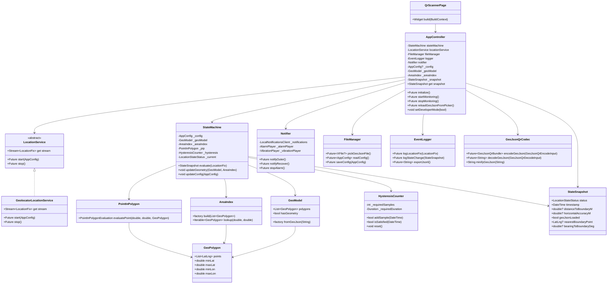
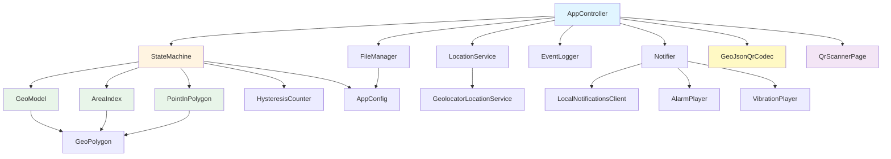
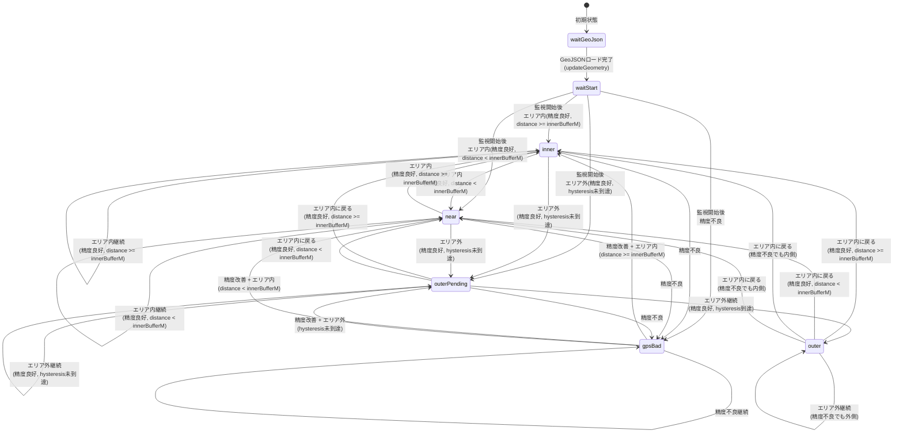

# Argus 仕様書 v6（2026-06-17 時点）

本ドキュメントは Flutter 製アプリ Argus の現行コードをもとに構成・挙動・テスト観点を整理したものです。現在の実装を正とし、仕様変更時は実装・テスト・関連ドキュメントを同時に更新します。

---

## 0. 概要

- **目的**: GeoJSON で定義した警戒エリアからの逸脱を端末上で監視し、離脱時に即時アラートを発報する。OUTER状態時には復帰のための距離・方位情報を提供する。
- **利用想定**: 保護対象者の無断外出検知、現場作業者の安全区域逸脱監視、競技エリア監視など。
- **対応プラットフォーム**: Flutter 3.x / Dart 3.2+。Android 9 以降、iOS 15 以降を想定。
- **位置取得**: Geolocator を利用し、最短 3 秒間隔・距離フィルタ 0m で継続的に測位。Android では Foreground Service、iOS では常時位置情報を前提。

---

## 1. 機能要件

### 1.1 GeoJSON 読み込み

- **初回起動**: GeoJSON は自動ロードしない。状態は `waitGeoJson` で開始し、ユーザーがファイルまたは QR から読み込む。
- **ファイルピッカー**: ユーザは FloatingActionButton（「Load GeoJSON」ラベル）またはファイルピッカーで `.geojson` / `.json` を再ロード可能。
- **QRコード読み込み**: ユーザは FloatingActionButton（「Read QR code」ラベル）でQRコードをスキャンし、GeoJSONを読み込むことが可能。QRコードは `agz1:` または互換用の `gjz1:` スキームで始まる必要がある。読み込んだGeoJSONは一時ファイルとして保存され、アプリ終了時に自動削除される。
- **ファイル名処理**: 読み込んだファイル名は `.geojson` 拡張子に正規化され、UI に表示される。`agz1` では埋め込まれた元ファイル名を表示し、一時ファイルの実体は `temp_geojson_<timestamp>.geojson` として管理する。
- **エラー処理**: 読み込み失敗はエラーバナーとログ（レベル ERROR）で通知。`FormatException` とその他の例外を区別して表示。QRコードの形式が無効な場合やデコードに失敗した場合も適切にエラーを表示する。

### 1.2 位置情報ストリーム

- **Geolocator 設定**: `getPositionStream` を利用。
  - **サンプリング間隔**: `AppConfig.sampleIntervalS['fast']` を優先使用。存在しない場合は最小値を選択。デフォルトは 3 秒。iOSではOSが更新頻度を管理するため、この値は厳密な配信間隔を保証しない。
  - **距離フィルタ**: 0m（すべての位置更新を受信）。
- **Android 設定**:
  - `AndroidSettings` を使用
  - `accuracy: LocationAccuracy.best`
  - `forceLocationManager: false`
  - `ForegroundNotificationConfig` で通知を表示（タイトル: 「ARGUSが位置情報を監視中です」、本文: 「画面を消しても位置情報の追跡は継続されます。」）
  - `enableWakeLock: true`, `setOngoing: true`
- **iOS/macOS 設定**:
  - `AppleSettings` を使用
  - `accuracy: LocationAccuracy.best`
  - `pauseLocationUpdatesAutomatically: false`
  - `showBackgroundLocationIndicator: true`
- **権限確認**: 監視開始前に位置サービス有効 + `LocationPermission.always` を確認する。`whileInUse` から foreground → background の順に要求し、拒否時は app/location settings への導線を表示する。通知権限は警告を見逃さないための setup 対象だが、監視開始ブロック条件ではない。

### 1.3 状態遷移ロジック

- **状態機械**: `StateMachine` が GeoJSON と設定値（閾値）を参照し、位置情報を評価して状態を算出。
- **状態一覧**:
  - `waitGeoJson`: GeoJSON 未ロード。ユーザにロード操作を促す。
  - `waitStart`: 監視準備完了。位置ストリームは未開始。スタートボタンを待っている状態。
  - `inner`: エリア内かつバッファより十分内側（`distanceToBoundaryM >= innerBufferM`）。
  - `near`: エリア内だがバッファ距離未満（`distanceToBoundaryM < innerBufferM`）。
  - `outerPending`: エリア外候補。ヒステリシス確定待ち。
  - `outer`: エリア外確定。通知・アラーム発火。
  - `gpsBad`: 位置精度不足（`accuracyMeters > gpsAccuracyBadMeters`）。ただし、OUTER 状態時は特別処理（後述）。
- **判定フロー**:
  1. GeoJSON 未ロード → `waitGeoJson`
  2. 測位の可用性チェック: `accuracyMeters == null || 非有限 || > gpsAccuracyBadMeters`、または緯度経度が非有限・範囲外
     - 座標がNaNや範囲外だとバウンディングボックス比較がすべてfalseになり、候補ポリゴンが空・距離がNaNになる。素通しすると「エリア外だがOUTERに確定しない」`outerPending` のまま警報が鳴らないため、精度不良と同じ扱いにする
     - OUTER 状態でない場合: `gpsBad` に遷移。ヒステリシスはリセットしない（使えない測位は「エリア内に戻った証拠」ではないため）
     - OUTER 状態の場合: 位置が内側に見えても警告を解除せず OUTER を維持し、距離情報を最善努力で提供。精度良好なfixだけが `inner`/`near` に復帰できる
  3. 精度良好の場合: エリア内/外を判定
     - エリア内: `inner`/`near`（距離に応じて）に遷移、ヒステリシスリセット
     - エリア外: ヒステリシスカウンタを更新。条件を満たせば `outer`、満たさなければ `outerPending`
- **ヒステリシス**: OUTER 確定には `leaveConfirmSamples` 回の連続サンプル AND 最初の有効なエリア外判定から `leaveConfirmSeconds` 秒の実経過時間が必要。GPSサンプルのtimestampは判定時間に使わない。内側に戻ると即座にリセット。
- **空間インデックス**: `AreaIndex` がポリゴンの境界ボックスを使用して候補ポリゴンを絞り込み、評価対象を最適化。

### 1.4 点とポリゴンの判定

- **包含判定**: Ray Casting アルゴリズムを使用。ポリゴンの各辺との交差をカウントして内外を判定。
- **距離計算**: ポリゴンの各辺から最近接点を計算し、Haversine 公式で距離を算出（単位: メートル）。
- **方位角計算**: 現在位置から最寄り境界点への方位角を計算（0-360度、北が0度）。
- **最寄り境界点**: ポリゴン境界上の最近接点の座標を保持。

### 1.5 バックグラウンド動作

- **Android**: 位置サービスは Foreground Service として継続。`WAKE_LOCK` / `FOREGROUND_SERVICE_LOCATION` 権限を要求。
- **iOS**: Info.plist で `location` / `audio` 背景モードを有効化し、Always 許可を促す文言を日本語で表示。
- **GPS途絶検知**: 最終fixから `max(15秒, 取得間隔×3)` で監視停止警告と短い振動を出し、1/2/4/8/16/30秒のバックオフで位置サービスへ再接続する。経過時間の判定は監視セッションが持つ単調増加クロックで行い、壁時計は使わない。
- **途絶警告の反復**: 途絶が続くあいだ既定60秒間隔で警告を出し直し、本文に経過時間を含める。1回だけの通知では、無音通知と1回の短い振動を見逃した時点で監視の停止に気づけなくなるため。fix復帰・監視停止で反復を止める。
- **iOSバックグラウンドの可聴性**: 途絶警告の通知は iOS で `presentSound: true` と `interruptionLevel: timeSensitive` を指定する。アプリが停止していると `Timer` も `AudioServices` も動かないため、通知音がバックグラウンドで唯一届く経路になる。警報音（`alarm.caf`）とは区別するため既定音を使う。
- **再接続の権限再確認**: 再開前に監視権限を再確認する。権限が失効している場合は自動再接続を打ち切り、権限の案内を表示する。権限確認そのものが失敗した場合は打ち切らず再開を試す。
- **再接続の打ち切り**: 位置サービスの再開が連続5回失敗した場合は自動再接続を打ち切り、位置情報サービスと権限の確認を促す。「再開できたがfixが来ない」状態は打ち切らず待ち続ける。打ち切り後もライフサイクルは `stale` を維持し、アプリのレジュームを契機に再試行する。
- **プロセス終了**: 画面ロック・他アプリ利用中は継続するが、強制終了またはOSによるプロセス終了後の自動復元は行わない。
- **後始末のタイムアウト**: 監視停止・アプリ終了時のプラットフォーム呼び出し（通知の取り消し、警報停止、位置サービス停止、購読解除）と監視開始時の位置サービス開始は5秒で打ち切る。ネイティブが応答しないと `starting` / `stopping` から抜けられず、開始も停止も設定変更もできないままアプリ再起動しか復帰手段がなくなるため。打ち切りはログに残す。

### 1.5.1 設定の保存と読み込み

- **保存の順序**: `updateConfig` は永続化に成功してから、メモリ・状態機械・音量へ適用する。逆順だと保存に失敗したとき、画面には「設定の反映に失敗しました」と出るのに動作中の閾値はすでに変わっており、次回起動で元へ戻る。保存を待つ間に監視が開始されていた場合は適用しない。
- **読み込みの失敗**: 設定ファイルが存在しない（初回起動）場合と、存在するのに読めない場合を区別する。後者は利用者が調整した閾値が黙って初期値へ戻ることを意味するため、起動時にエラーメッセージで知らせる。

### 1.6 通知とアラーム

- **初期化**: `Notifier.initialize()` は実行中のFutureを共有する。完了フラグを最後に立てるだけだと、OUTER発報とGPS途絶警告が同時に走ったとき両方が初期化を通過し、プラグイン初期化とチャネル作成が二重に実行される。失敗時は記憶を捨て、次回やり直せるようにする。

- **通知チャンネル**: `ARGUS警告`（ID: `argus_alerts_visual_v2`）。説明は「ジオフェンスの安全エリアから離れたときに通知します。」。通知音・通知バイブは無効化し、音声アラームとバイブレーションはネイティブ実装に一本化する。
- **監視状態チャンネル**: `ARGUS監視状態`（ID: `argus_monitoring_health_v1`）。GPS途絶時の通知IDは `1002`。
- **独立発報**: OUTER通知、警報音、連続バイブは独立して開始し、1経路が失敗しても他経路を実行する。
- **開始前の消音**: 監視開始時に試聴音と前回停止に失敗した警報を止める。判定は「停止呼び出しが失敗したか」ではなく「実際に鳴っていないか」で行い、止められない場合は監視を開始しない。常時鳴っている音があると本物のOUTER警報と区別できず、警報が意味を持たなくなるため。
- **試聴音の扱い**: 試聴中も警報チャネルは実際に鳴っているため、本番の発報と同じ再生中状態を持つ。設定画面を閉じるときの停止は結果を待てないので、失敗した場合は警告として残す。
- **停止失敗の扱い**: 警報音・連続バイブの再生中フラグは停止に成功した場合だけ倒す。停止に失敗した経路は「実際に鳴っているか不明」として記録し、次の発報では「すでに鳴っている」という近道を使わず必ず開始し直す。近道を通すとサイレンを開始しないまま成功を返してしまうため。停止できていない場合は「警報を停止できませんでした。音やバイブが続く場合は端末の音量を下げ、アプリを再起動してください。」を表示する。スヌーズは停止に成功した場合だけミュート状態に入る。
- **発報失敗の扱い**: OUTER発報で失敗した経路があれば、失敗した経路名を含めて画面に表示する。ログだけに残すと、警報音が鳴っていないのに通常のOUTER画面が出て「警報は動いている」と誤解される。
- **通知内容**: OUTER 状態への遷移時に通知を表示
  - タイトル: `ARGUS警告`
  - 本文: `競技エリアから離れています。`（実装では「競技エリア」と記載）
  - Android: `Importance.max`, `Priority.max`, `category: AndroidNotificationCategory.alarm`, `playSound: false`, `enableVibration: false`
  - iOS: 視覚通知は `interruptionLevel: InterruptionLevel.timeSensitive`。音は `AVAudioPlayer` のネイティブループ再生に一本化。
- **Foreground Service 通知**: Android 背景計測用にチャンネル名 `ARGUSバックグラウンド監視`、タイトル「ARGUSが位置情報を監視中です」、本文「画面を消しても位置情報の追跡は継続されます。」を表示する。
- **アラーム音**: Android / iOS は `argus/alarm` MethodChannel のネイティブループ再生を使用。iOSは画面ロック中の到達性を確保するため、Time Sensitiveローカル通知にもバンドル済み `alarm.caf` を設定する。フォアグラウンドでは通知音を提示せずネイティブ再生を使う。`Notifier.stopAlarm()` で停止。
- **iOS警告音テスト**: 設定画面から現在のスライダー音量で音声だけを開始・停止できる。通知・バイブは発生せず、ホーム画面でも継続する。設定画面終了、監視開始、アプリ終了では停止する。
- **バイブレーション**: Android / iOS は `argus/alarm` MethodChannel のネイティブ実装を使用。Android は `VibrationEffect` の波形、iOS は `AudioServicesPlaySystemSound(kSystemSoundID_Vibrate)` の繰り返しで警告中のバイブを制御する。
- **音量チェック**: Android は監視開始前に端末のアラーム音量を確認し、`percent >= 0.5` なら開始可、50% 未満なら開始をブロックして「５０％以上」警告と音設定画面への導線を表示する。取得失敗時は warning ログを残し、監視開始はブロックしない。
- **音設定**: MethodChannel `argus/alarm` の `openSoundSettings` を呼ぶ。Android 側は `ACTION_SOUND_SETTINGS` を開き、失敗時は `ACTION_SETTINGS` にフォールバックする。iOS 側はアプリの設定画面を開く。iOS では警告音量をアプリ内から正確に取得できないため、`getAlarmVolumeState` は非対応である旨の代替応答を返す。
- **復帰通知**: INNER/NEAR 復帰時に通知をキャンセルし、アラームを停止。
- **権限要求**: 通知・位置情報の権限状態は `PermissionCoordinator` が確認・要求する。iOSの事前説明は単一の「続ける」のみで、拒否後に設定アプリを自動表示しない。設定はユーザーが権限カードから明示的に開く。Androidの拒否後導線は従来どおり維持する。`Notifier` は通知権限を直接要求しない。監視開始ブロック条件は位置サービス有効 + Always 位置権限。

### 1.7 退避ナビゲーション

- **表示条件**: OUTER 状態時、または開発者モード有効時
- **表示情報**:
  - 境界までの距離（メートル）
  - 方角（度 + 方位記号: N, NE, E, SE, S, SW, W, NW）
  - 最寄り境界点の座標（緯度、経度）
- **計算方法**: `PointInPolygon` が最寄り境界点を計算し、Haversine 公式で距離を算出、方位角を計算。
- **ログ/通知**: OUTER 状態への遷移時にログにナビゲーションヒントを追加（例: "Move 50m toward N (0deg) heading to lat=35.12345, lon=139.67890."）。

### 1.8 UI

#### HomePage

- **AppBar**: タイトル ARGUS（中央寄せ）、右上オーバーフローメニューから Settings へ遷移。
- **Body**:
  1. **状態バッジ**: 大きな円形バッジ（画面幅の70%）で状態を表示。状態別カラー。`waitStart` 状態ではタップ可能（リップルあり）で START として機能。
  2. **GeoJSON ファイル状態**: Chip 表示。未ロード時は情報アイコン付きの Chip、ロード済み時はファイル名 Chip を中央表示。
  3. **退避ナビゲーション**: OUTER 状態時または開発者モード時に距離・方角を表示。
  4. **開発者モード情報**: 開発者モード有効時のみ表示
     - 現在の状態名
     - Notes（あれば）
     - 最終更新時刻
     - 境界までの距離・方角・最寄り境界点座標
     - 位置精度
     - GeoJSON ロード状態
     - エラーメッセージ（あれば）
     - ログエントリ（最新5件）
  5. **エラーメッセージ**: Snackbar（自動フェード、フローティング）。
- **主要操作**: 画面下部に常設（Start / Load GeoJSON / Read QR code）。親指リーチ最適化。FABは未使用。

#### SettingsPage

- **設定値表示**: 現在の設定値をテキスト表示
  - Inner buffer (m)
  - Leave confirm (samples / seconds)
  - GPS bad threshold (m)
- **Developer mode switch**: 距離/方位の詳細情報を常時表示するかどうかを切り替え。デフォルトは OFF。
- **Export logs ボタン**: JSON 形式でログをエクスポートし、ダイアログで表示。ユーザが手動でコピーする運用。

---

## 2. 非機能要件

- **パフォーマンス**: 位置取得・状態評価・ログ記録はいずれも非同期処理で UI スレッドを阻害しない。`AreaIndex` による空間インデックスで評価対象ポリゴンを絞り込み。
- **電力消費**: Android は WakeLock を活用しつつも位置リクエスト間隔は設定値で調整可能。iOS はバックグラウンド許可前提。
- **データ永続化**: 設定はアプリドキュメントディレクトリの `config.json` に保存。存在しない場合はデフォルト設定をロード。ログはメモリのみで保持し、最大 200 件のリングバッファ管理（`AppController._logs`）。
- **権限**: `PermissionCoordinator` が通知・位置情報（常時）許可を順序立てて確認・要求する。iOSは拒否後に明示操作で設定を開き、Androidは従来の自動設定導線を維持する。
- **ローカライズ**: 通知文言、位置許可文言、UI 文言は日本語がデフォルト。

---

## 3. プロジェクト構造

### 3.1 ディレクトリ構成

```
lib/
├── main.dart                    # アプリケーションエントリーポイント
├── app_controller.dart          # アプリケーション全体の状態管理とコーディネーション
├── geo/                         # 地理空間データ処理
│   ├── geo_model.dart          # GeoJSONパースとGeoModel/GeoPolygon/LatLng定義
│   ├── area_index.dart         # 空間インデックス（境界ボックスによる高速検索）
│   └── point_in_polygon.dart   # 点とポリゴンの包含判定・距離・方位角計算
├── state_machine/              # 状態機械
│   ├── state.dart              # LocationStateStatus enum, StateSnapshot定義
│   ├── state_machine.dart      # 状態遷移ロジックと評価処理
│   └── hysteresis_counter.dart # ヒステリシスカウンタ（OUTER確定のための条件管理）
├── platform/                    # プラットフォーム固有機能
│   ├── location_service.dart  # 位置情報サービス（Geolocator抽象化）
│   └── notifier.dart          # 通知・アラーム制御
├── qr/                         # QRコード機能
│   └── geojson_qr_codec.dart  # GeoJSONとQRコードの相互変換（gzip圧縮、Base64URLエンコード）
├── io/                         # ファイルI/Oと設定管理
│   ├── config.dart            # AppConfig定義とJSONシリアライゼーション
│   ├── file_manager.dart      # 設定ファイル・GeoJSONファイルの読み書き
│   ├── logger.dart            # EventLogger（GPS・状態イベントの記録）
│   └── log_entry.dart         # AppLogEntry/AppLogLevel定義
└── ui/                         # ユーザーインターフェース
    ├── home_page.dart         # メイン画面（状態表示、ナビゲーション情報）
    ├── settings_page.dart      # 設定画面（パラメータ調整、開発者モード）
    └── qr_scanner_page.dart    # QRコードスキャン画面（カメラを使用したQRコード読み取り）
```

### 3.2 アーキテクチャ概要

| 区分             | 主要クラス                                                                     | 役割                                                                                 |
| ---------------- | ------------------------------------------------------------------------------ | ------------------------------------------------------------------------------------ |
| 中核ロジック     | `AppController`                                                                | アプリ全体の状態管理、位置ストリームの購読、ログ記録、通知制御、QRコードからのGeoJSON読み込み。 |
| 状態機械         | `StateMachine`, `StateSnapshot`, `LocationStateStatus`                         | 位置評価と状態管理、ヒステリシス処理。                                               |
| ジオメトリ       | `GeoModel`, `GeoPolygon`, `LatLng`                                             | GeoJSON パース、ポリゴンデータの保持。                                               |
| 空間インデックス | `AreaIndex`                                                                    | ポリゴンの境界ボックスによる空間インデックス。位置に基づいて候補ポリゴンを絞り込み。 |
| 点とポリゴン判定 | `PointInPolygon`, `PointInPolygonEvaluation`                                   | Ray Casting による包含判定、最近接点・距離・方位角の計算。                           |
| QRコード         | `GeoJsonQrCodec`, `encodeGeoJson`, `decodeGeoJson`                            | GeoJSONのgzip圧縮、Base64URLエンコード、QRコード生成・復元。                        |
| 位置サービス     | `LocationService`, `GeolocatorLocationService`, `LocationFix`                  | 位置ストリームの開始・停止、権限確認、プラットフォーム固有設定。                     |
| 通知             | `Notifier`, `AlarmPlayer`（`NativeAlarmPlayer`）, `VibrationPlayer`（`NativeVibrationPlayer`）, `LocalNotificationsClient` | 通知チャンネル作成、アラーム音・バイブ制御、バッジ状態。                             |
| ログ             | `EventLogger`, `AppLogEntry`, `AppLogLevel`                                    | GPS・状態イベントのメモリ記録と UI 連携、JSON エクスポート。                         |
| I/O              | `FileManager`, `AppConfig`                                                     | 設定・GeoJSON ファイルの読み書き、ファイルピッカー。                                 |
| UI               | `HomePage`, `SettingsPage`, `QrScannerPage`, `ArgusApp`                       | 画面構成とユーザ操作ルーティング。                                                   |

### 3.3 データフロー

1. **初期化**: `main()` → `AppController.bootstrap()` → 各サービス初期化
2. **GeoJSON読み込み（ファイルピッカー）**: `FileManager.pickGeoJsonFile()` → `GeoModel.fromGeoJson()` → `AreaIndex.build()` → `StateMachine.updateGeometry()`
3. **GeoJSON読み込み（QRコード）**: `QrScannerPage` → `AppController.reloadGeoJsonFromQr()` → `decodeGeoJson()` → 一時ファイル保存 → `GeoModel.fromGeoJson()` → `AreaIndex.build()` → `StateMachine.updateGeometry()`
4. **位置監視**: `LocationService.stream` → `AppController._handleFix()` → `StateMachine.evaluate()` → `Notifier`更新
5. **状態表示**: `AppController.snapshot` → `HomePage`（リアクティブ更新）
6. **アプリ終了時**: `WidgetsBindingObserver.didChangeAppLifecycleState()` → `AppController.cleanupTempGeoJsonFile()` → 一時ファイル削除

### 3.4 依存関係

- **AppController** ← StateMachine, LocationService, FileManager, EventLogger, Notifier, GeoJsonQrCodec
- **StateMachine** ← GeoModel, AreaIndex, PointInPolygon, AppConfig, HysteresisCounter
- **GeoModel** ← GeoJSON（パース）
- **PointInPolygon** ← 地理計算（Haversine公式など）
- **GeoJsonQrCodec** ← gzip、Base64URL、SHA256、QR生成
- **QrScannerPage** ← AppController（Provider経由）、MobileScanner
- **UI** ← AppController（Provider経由）

全モジュールは依存注入で連結され、`AppController.bootstrap()` が標準構成を生成する。

### 3.5 クラス図


```mermaid
classDiagram
    class AppController {
        -StateMachine stateMachine
        -LocationService locationService
        -FileManager fileManager
        -EventLogger logger
        -Notifier notifier
        -AppConfig? _config
        -GeoModel _geoModel
        -AreaIndex _areaIndex
        -StateSnapshot _snapshot
        +StateSnapshot get snapshot
        +Future initialize()
        +Future startMonitoring()
        +Future stopMonitoring()
        +Future reloadGeoJsonFromPicker()
        +void setDeveloperMode(bool)
    }
    
    class StateMachine {
        -AppConfig _config
        -GeoModel _geoModel
        -AreaIndex _areaIndex
        -PointInPolygon _pip
        -HysteresisCounter _hysteresis
        -LocationStateStatus _current
        +StateSnapshot evaluate(LocationFix)
        +void updateGeometry(GeoModel, AreaIndex)
        +void updateConfig(AppConfig)
    }
    
    class LocationService {
        <<abstract>>
        +Stream~LocationFix~ get stream
        +Future start(AppConfig)
        +Future stop()
    }
    
    class GeolocatorLocationService {
        +Stream~LocationFix~ get stream
        +Future start(AppConfig)
        +Future stop()
    }
    
    class Notifier {
        -LocalNotificationsClient _notifications
        -AlarmPlayer _alarmPlayer
        -VibrationPlayer _vibrationPlayer
        +Future notifyOuter()
        +Future notifyRecover()
        +Future stopAlarm()
    }
    
    class GeoModel {
        +List~GeoPolygon~ polygons
        +bool hasGeometry
        +factory fromGeoJson(String)
    }
    
    class GeoPolygon {
        +List~LatLng~ points
        +double minLat
        +double maxLat
        +double minLon
        +double maxLon
    }
    
    class AreaIndex {
        +factory build(List~GeoPolygon~)
        +Iterable~GeoPolygon~ lookup(double, double)
    }
    
    class PointInPolygon {
        +PointInPolygonEvaluation evaluatePoint(double, double, GeoPolygon)
    }
    
    class HysteresisCounter {
        -int _requiredSamples
        -Duration _requiredDuration
        +bool addSample(DateTime)
        +bool isSatisfied(DateTime)
        +void reset()
    }
    
    class StateSnapshot {
        +LocationStateStatus status
        +DateTime timestamp
        +double? distanceToBoundaryM
        +double? horizontalAccuracyM
        +bool geoJsonLoaded
        +LatLng? nearestBoundaryPoint
        +double? bearingToBoundaryDeg
    }
    
    class FileManager {
        +Future~XFile?~ pickGeoJsonFile()
        +Future~AppConfig~ readConfig()
        +Future saveConfig(AppConfig)
    }
    
    class EventLogger {
        +Future logLocationFix(LocationFix)
        +Future logStateChange(StateSnapshot)
        +Future~String~ exportJsonl()
    }
    
    class GeoJsonQrCodec {
        +Future~GeoJsonQrBundle~ encodeGeoJson(GeoJsonQrEncodeInput)
        +Future~String~ decodeGeoJson(GeoJsonQrDecodeInput)
        +String minifyGeoJson(String)
    }
    
    class QrScannerPage {
        +Widget build(BuildContext)
    }
    
    AppController --> StateMachine
    AppController --> LocationService
    AppController --> FileManager
    AppController --> EventLogger
    AppController --> Notifier
    AppController --> StateSnapshot
    AppController --> GeoJsonQrCodec
    StateMachine --> GeoModel
    StateMachine --> AreaIndex
    StateMachine --> PointInPolygon
    StateMachine --> HysteresisCounter
    StateMachine --> StateSnapshot
    GeoModel --> GeoPolygon
    AreaIndex --> GeoPolygon
    PointInPolygon --> GeoPolygon
    LocationService <|.. GeolocatorLocationService
    QrScannerPage --> AppController
```

### 3.6 依存関係図


```mermaid
graph TD
    A[AppController] --> B[StateMachine]
    A --> C[LocationService]
    A --> D[FileManager]
    A --> E[EventLogger]
    A --> F[Notifier]
    
    B --> G[GeoModel]
    B --> H[AreaIndex]
    B --> I[PointInPolygon]
    B --> J[HysteresisCounter]
    B --> K[AppConfig]
    
    G --> L[GeoPolygon]
    H --> L
    I --> L
    
    C --> M[GeolocatorLocationService]
    
    F --> N[LocalNotificationsClient]
    F --> O[AlarmPlayer]
    F --> P[VibrationPlayer]
    
    A --> Q[GeoJsonQrCodec]
    A --> R[QrScannerPage]
    
    D --> K
    
    style A fill:#e1f5ff
    style B fill:#fff4e1
    style G fill:#e8f5e9
    style H fill:#e8f5e9
    style I fill:#e8f5e9
    style Q fill:#fff9c4
    style R fill:#f3e5f5
```

---

## 4. 位置ステートマシン詳細

### 4.1 状態一覧

| 状態           | 説明                                         | 遷移条件                                                   |
| -------------- | -------------------------------------------- | ---------------------------------------------------------- |
| `waitGeoJson`  | GeoJSON 未ロード。ユーザにロード操作を促す。 | GeoJSON が未ロードの状態。                                 |
| `waitStart`    | 監視準備完了。位置ストリームは未開始。       | GeoJSON ロード後、位置監視開始前。                         |
| `inner`        | エリア内かつバッファより十分内側。           | `contains == true && distanceToBoundaryM >= innerBufferM`  |
| `near`         | エリア内だがバッファ距離未満。               | `contains == true && distanceToBoundaryM < innerBufferM`   |
| `outerPending` | エリア外候補。ヒステリシス確定待ち。         | `contains == false && !hysteresis.isSatisfied`             |
| `outer`        | エリア外確定。通知・アラーム発火。           | `contains == false && hysteresis.isSatisfied`              |
| `gpsBad`       | 位置精度不足。OUTER 維持しつつも補正が入る。 | `accuracyMeters > gpsAccuracyBadMeters && status != outer` |

### 4.2 判定パラメータ

- `innerBufferM`: エリア境界との距離バッファ。この距離未満で `near` 状態になる。
- `leaveConfirmSamples`: OUTER 確定に必要な連続サンプル数（デフォルト: 3）。
- `leaveConfirmSeconds`: OUTER 確定に必要な経過秒数（デフォルト: 10）。
- `gpsAccuracyBadMeters`: 精度閾値。超過で `gpsBad`（デフォルト: 40m）。ただし OUTER 状態時は特別処理。

### 4.3 評価フロー

1. **GeoJSON チェック**: `_geoModel.hasGeometry == false` なら `waitGeoJson` を返す。
2. **精度チェック**: `fix.accuracyMeters == null || fix.accuracyMeters! > _config.gpsAccuracyBadMeters`
   - OUTER 状態でない場合: `gpsBad` に遷移。ヒステリシスは維持する
   - OUTER 状態の場合:
     - 内側に戻ったかどうかを判定（`AreaIndex.lookup` + `PointInPolygon.evaluatePoint`）
     - 内外にかかわらず OUTER を維持し、距離情報を最善努力で提供する
     - 精度良好なfixが内側になった場合だけ `inner`/`near` へ復帰する
3. **包含判定**: `AreaIndex.lookup` で候補ポリゴンを絞り込み、`PointInPolygon.evaluatePoint` で判定
   - エリア内: `inner`/`near`（距離に応じて）に遷移、ヒステリシスリセット
   - エリア外: GPS timestampではなく、監視開始後の単調増加する実経過時間でヒステリシスカウンタを更新
     - 条件を満たせば `outer`
     - 満たさなければ `outerPending`
4. **距離・方位角計算**: 包含判定と同時に `PointInPolygon` が最寄り境界点・距離・方位角を計算。`StateSnapshot` に格納。

### 4.3.1 状態遷移図

**監視開始前の状態遷移**:
- `waitGeoJson` → `waitStart`: GeoJSONロード完了時（`updateGeometry()`）
- `waitGeoJson`: GeoJSON未ロード時に`evaluate()`が呼ばれた場合

**監視開始後の状態遷移**（位置評価により発生）:


```mermaid
stateDiagram-v2
    [*] --> waitGeoJson: 初期状態
    waitGeoJson --> waitStart: GeoJSONロード完了<br/>(updateGeometry)
    
    waitStart --> inner: 監視開始後<br/>エリア内(精度良好, distance >= innerBufferM)
    waitStart --> near: 監視開始後<br/>エリア内(精度良好, distance < innerBufferM)
    waitStart --> outerPending: 監視開始後<br/>エリア外(精度良好, hysteresis未到達)
    waitStart --> gpsBad: 監視開始後<br/>精度不良
    
    inner --> inner: エリア内継続<br/>(精度良好, distance >= innerBufferM)
    inner --> near: エリア内<br/>(精度良好, distance < innerBufferM)
    inner --> outerPending: エリア外<br/>(精度良好, hysteresis未到達)
    inner --> gpsBad: 精度不良
    
    near --> inner: エリア内<br/>(精度良好, distance >= innerBufferM)
    near --> near: エリア内継続<br/>(精度良好, distance < innerBufferM)
    near --> outerPending: エリア外<br/>(精度良好, hysteresis未到達)
    near --> gpsBad: 精度不良
    
    outerPending --> inner: エリア内に戻る<br/>(精度良好, distance >= innerBufferM)
    outerPending --> near: エリア内に戻る<br/>(精度良好, distance < innerBufferM)
    outerPending --> outer: エリア外継続<br/>(精度良好, hysteresis到達)
    outerPending --> outerPending: エリア外継続<br/>(精度良好, hysteresis未到達)
    outerPending --> gpsBad: 精度不良
    
    outer --> inner: エリア内に戻る<br/>(精度良好, distance >= innerBufferM)
    outer --> near: エリア内に戻る<br/>(精度良好, distance < innerBufferM)
    outer --> inner: エリア内に戻る<br/>(精度不良でも内側)
    outer --> near: エリア内に戻る<br/>(精度不良でも内側)
    outer --> outer: エリア外継続<br/>(精度不良でも外側)
    
    gpsBad --> inner: 精度改善 + エリア内<br/>(distance >= innerBufferM)
    gpsBad --> near: 精度改善 + エリア内<br/>(distance < innerBufferM)
    gpsBad --> outerPending: 精度改善 + エリア外<br/>(hysteresis未到達)
    gpsBad --> gpsBad: 精度不良継続
```

**状態遷移の説明**:

- **waitGeoJson → waitStart**: `updateGeometry()` で GeoJSON がロードされたとき
- **精度良好時の遷移**:
  - エリア内: `inner` または `near`（距離に応じて）
  - エリア外: `outerPending`（hysteresis未到達）または `outer`（hysteresis到達）
- **精度不良時の遷移**:
  - OUTER 以外の状態: `gpsBad` に遷移。ヒステリシスは維持する
  - OUTER 状態: 内側に見える場合も `outer` を維持し、精度良好なfixを待つ
- **hysteresis**: 精度良好なfixでエリア内に戻ると即座にリセットされ、`inner`/`near` に遷移。精度不良や座標不正のfixではリセットしない

### 4.4 ヒステリシスカウンタ

- **実装**: `HysteresisCounter` クラス
- **条件**: `requiredSamples` 回の連続サンプル AND 最初の有効なエリア外判定から `requiredDuration` 秒の実経過
- **リセット**: エリア内に戻ったとき、または `StateMachine.updateGeometry()` が呼ばれたとき

---

## 5. GeoJSON パース仕様

- **対応形式**: GeoJSON FeatureCollection。`Polygon` と `MultiPolygon` をサポート。
- **座標系**: GeoJSON 標準（経度、緯度の順）。パース時に `LatLng(latitude, longitude)` に変換。
- **ポリゴン処理**:
  - 穴付きPolygonは対応外として明示的に拒否する。穴の個数をエラーに含める。
  - `geometry` を持たないFeature、Polygon/MultiPolygon以外のgeometry type、空の `features`、空の `MultiPolygon` は黙って読み飛ばさずエラーにする。競技エリアが欠けたまま監視を開始しないため。
  - 連続する重複頂点は自己交差とは別の専用エラーで拒否する。
  - エラーメッセージには `Feature[i] のPolygon[j] の頂点[k]` の位置と実際の値を含める。緯度経度の範囲外は座標順（`[経度, 緯度]`）の取り違えを案内する。
  - 始点と終点が一致しないリング、3つ未満の異なる頂点、面積0、非数・非有限値、緯度経度の範囲外を拒否する。
  - UTF-8で1MB、Polygon 10個、1 Polygon 5,000頂点、合計10,000頂点を上限とする。
- **プロパティ**: `name` と `version` を読み込み（現在は未使用）。
- **空間インデックス**: `AreaIndex.build()` が各ポリゴンの境界ボックスを計算し、インデックスを構築。

---

## 5.1 QRコード機能仕様

### 5.1.1 エンコード処理

- **標準形式**: 単一Feature・単一Polygon・外周リングをscale 6の整数差分列へ変換し、元ファイル名とともに `a3:<scale>:<filename>:<coordinates>` へ格納。
- **圧縮**: gzip圧縮（level=9）を使用。外部CLIは不要。
- **エンコード**: Base64URLエンコード（パディングなし、URL-safe文字）。
- **ハッシュ**: `agz1` には付与しない。互換用`gjz1`では最小化されたGeoJSONのSHA256ハッシュを使用可能。
- **QRテキスト形式**: 
  - 標準: `agz1:<base64url(gzip(a3本文))>`
  - 互換: `gjz1:<base64url_payload>[#<hash>]`
- **容量制限**: QRテキスト長が`maxQrTextLength`（デフォルト2500文字）を超える場合、`PayloadTooLargeException`を返す。
- **QR画像生成**: PNG形式でQRコード画像を生成（オプション、デフォルト有効）。画像名は `QR_<GeoJSONのstem>.png`。

### 5.1.2 デコード処理

- **スキーム検証**: QRテキストが`agz1:`または`gjz1:`で始まることを確認。
- **Base64URLデコード**: パディングを自動補完してデコード。
- **gzip展開**: Dart標準の`GZipCodec`で展開し、展開後1MBを超えた時点で中止する。
- **ハッシュ検証**: `gjz1`では復元されたGeoJSONのハッシュをQRテキストと比較（`verifyHash=true`の場合）。
- **GeoJSON検証**: 復元された文字列が有効なGeoJSONであることを確認（`type`フィールドの存在）。

### 5.1.3 エラーハンドリング

- **GeoJsonValidationException**: GeoJSONの構造が無効な場合。
- **CompressFailedException**: gzip圧縮に失敗した場合。
- **DecompressFailedException**: gzip展開に失敗した場合。
- **DecodeFailedException**: Base64URLデコードに失敗した場合。
- **HashMismatchException**: ハッシュが一致しない場合。
- **UnsupportedSchemeException**: サポートされていないスキームの場合。
- **PayloadTooLargeException**: QRコードの容量を超える場合。
- **Base64DecodeFailedException / GzipDecompressFailedException**: `agz1`外装の破損。
- **InvalidDiffTextException / InvalidScaleException / InvalidCoordinateException**: `a3`本文の破損。
- **TooFewPointsException / PolygonNotClosedException / UnsupportedGeometryException**: AGZ対象外のPolygon構造。
- **InvalidFileNameException**: 埋め込みファイル名が空、不正、または長すぎる場合。

### 5.1.4 一時ファイル管理

- **保存場所**: `getTemporaryDirectory()`で取得した一時ディレクトリ。
- **ファイル名**: 実体は `temp_geojson_<timestamp>.geojson`（`timestamp`はミリ秒単位のエポック時刻）。`agz1`の表示名は埋め込まれた元ファイル名。
- **クリーンアップ**: アプリが完全終了時（`AppLifecycleState.detached`）に自動削除。新しいQRコードを読み込む際も既存の一時ファイルを削除。

---

## 6. ログ仕様

### 6.1 アプリ内ログ（AppController）

- **保持**: `AppController._logs` に最大 200 件を保持（新しい順）。超過時は古いものから削除。
- **ログレベル**: `debug` / `info` / `warning` / `error`
  - `debug`: GPS 受信（緯度、経度、精度）
  - `info`: 状態変化、初期化完了、GeoJSON ロード
  - `warning`: 外出警告（OUTER 状態への遷移）
  - `error`: 例外、GeoJSON 読み込み失敗
- **表示**: `HomePage` で開発者モード時のみ最新5件をカード形式で表示。レベルに応じた色・アイコンを表示。

### 6.2 イベントログ（EventLogger）

- **保持**: `EventLogger._records` に新しいイベントを最大20,000件記録（メモリのみ）。上限超過時は最古を削除する。
- **イベントタイプ**:
  - `location`: GPS 受信（`lat`, `lon`, `accuracyM`, `batteryPct`, `timestamp`）
  - `state`: 状態変化（`status`, `distanceToBoundaryM`, `accuracyM`, `bearingDeg`, `nearestLat`, `nearestLon`, `notes`, `timestamp`）
- **エクスポート**: `exportJsonl()` で JSON 形式（配列）を返す。ファイル書き込みは行わない。

---

## 7. 通知・アラーム仕様

### 7.1 通知チャンネル

- **ID**: `argus_alerts_visual_v2`
- **名前**: `ARGUS警告`
- **説明**: `ジオフェンスの安全エリアから離れたときに通知します。`
- **Android 設定**: `Importance.max`, `playSound: false`, `enableVibration: false`

### 7.2 OUTER 通知

- **通知ID**: `1001`
- **タイトル**: `ARGUS警告`
- **本文**: `競技エリアから離れています。`（実装では「競技エリア」と記載）
- **Android**: `Importance.max`, `Priority.max`, `category: AndroidNotificationCategory.alarm`, `playSound: false`, `enableVibration: false`
- **iOS**: 視覚通知は `interruptionLevel: InterruptionLevel.timeSensitive`。音は `AVAudioPlayer` のネイティブループ再生に一本化。
- **アラーム**: 通知と同時に同梱の警報音をネイティブでループ再生開始。端末の既定通知音には依存しない。

### 7.3 復帰通知

- INNER/NEAR 復帰時に通知ID `1001` をキャンセルし、アラームを停止。

### 7.4 Foreground Service 通知（Android）

- **チャンネル名**: `ARGUSバックグラウンド監視`
- **タイトル**: `ARGUSが位置情報を監視中です`
- **本文**: `画面を消しても位置情報の追跡は継続されます。`
- **設定**: `enableWakeLock: true`, `setOngoing: true`

---

## 8. 設定仕様

### 8.1 設定ファイル

- **パス**: アプリドキュメントディレクトリの `config.json`
- **デフォルト**: `assets/config/default_config.json`
- **読み込み**: `FileManager.readConfig()` がファイルを読み込み。存在しない場合はデフォルト設定をロード。

### 8.2 設定項目

| 項目                  | キー                    | 型               | デフォルト                              | 説明                                                                       |
| --------------------- | ----------------------- | ---------------- | --------------------------------------- | -------------------------------------------------------------------------- |
| Inner buffer          | `inner_buffer_m`        | double           | 30.0                                    | エリア境界との距離バッファ（メートル）。この距離未満で `near` 状態になる。 |
| Leave confirm samples | `leave_confirm_samples` | int              | 3                                       | OUTER 確定に必要な連続サンプル数。                                         |
| Leave confirm seconds | `leave_confirm_seconds` | int              | 10                                      | OUTER 確定に必要な経過秒数。                                               |
| GPS bad threshold     | `gps_accuracy_bad_m`    | double           | 40.0                                    | 位置精度がこの値を超えると `gpsBad` 状態になる（メートル）。               |
| Sample interval       | `sample_interval_s`     | Map<String, int> | `{"slow": 15, "normal": 8, "fast": 3}`  | 位置取得間隔（秒）。`fast` が優先的に使用される。                          |
| Sample distance       | `sample_distance_m`     | Map<String, int> | `{"slow": 25, "normal": 15, "fast": 8}` | 距離フィルタ（未使用、位置サービスでは 0m 固定）。                         |
| Screen wake on leave  | `screen_wake_on_leave`  | bool             | true                                    | 離脱時に画面を点灯するか（未使用）。                                       |

---

## 9. 画面仕様

### 9.1 HomePage

- **AppBar**: タイトル ARGUS（中央寄せ）、右上オーバーフローメニューから Settings へ遷移。
- **Body**:
  1. **状態バッジ**: 大きな円形バッジ（画面幅の70%）で状態を表示。状態別カラー。`waitStart` 状態ではタップ可能（リップルあり）で START として機能。
  2. **GeoJSON ファイル状態**: Chip 表示。未ロード時は情報アイコン付きの Chip、ロード済み時はファイル名 Chip を中央表示。
  3. **退避ナビゲーション**: OUTER 状態時または開発者モード時に距離・方角を表示。
  4. **開発者モード情報**: 開発者モード有効時のみ表示（詳細は上記参照）。
  5. **エラーメッセージ**: Snackbar（自動フェード、フローティング）。
- **主要操作**: 画面下部に常設（Start / Load GeoJSON / Read QR code）。親指リーチ最適化。FABは未使用。

### 9.2 SettingsPage

- **設定値表示**: 現在の設定値をテキスト表示。
- **Developer mode switch**: 距離/方位の詳細情報を常時表示するかどうかを切り替え。デフォルトは OFF。
- **Export logs ボタン**: JSON 形式でログをエクスポートし、ダイアログで表示。

---

## 10. テストと検証

- `flutter analyze` を静的解析のベースラインとし、警告ゼロを維持する。
- `flutter test` で state / geo / QR / controller / platform contract / UI を検証する。
- `flutter test --coverage` と `scripts/parse_coverage.py` で 100% coverage を目標にする。
- Android 周辺は、音量 50% 境界、MethodChannel payload、通知チャンネル、OUTER 通知 ID `1001`、Foreground Service 文言、権限要求順序、音設定導線を契約テストで守る。
- GPS、カメラ、file picker、通知プラグインなど実機・OS 境界の薄い wrapper は `coverage:ignore` を許容し、Fake と contract test でアプリ側の判定を検証する。
- `integration_test/ui_smoke_test.dart` は実機 / emulator 向け smoke として、Home permission card、background disclosure、Settings、QR permission error、Home → Settings navigation に限定する。

---

## 11. 今後の検討事項

- ログフィルタ／検索 UI の追加（警告だけ表示する等）。
- 通知チャンネル別の細分化（警告・情報を分離）。
- バッテリー・位置権限のチュートリアル画面や再許可導線の強化。
- Foreground Service 通知タップでのアプリ復帰など、運用 UX の強化。
- GeoJSON ファイル名の表示改善（長いファイル名の省略表示など）。

---

## 参考リンク

- Geolocator: <https://pub.dev/packages/geolocator>
- flutter_local_notifications: <https://pub.dev/packages/flutter_local_notifications>
- permission_handler: <https://pub.dev/packages/permission_handler>
- file_selector: <https://pub.dev/packages/file_selector>

---

## 12. 実装詳細

### 12.1 ファイル名正規化

- `AppController._normalizeToGeoJson()`: ファイル名から拡張子を除去し、`.geojson` を追加。
- `AppController._extractFileName()`: パスからファイル名を抽出し、クエリパラメータやフラグメントを除去。

### 12.2 方位角の計算

- `PointInPolygon._bearingDegrees()`: Haversine 公式を使用して方位角を計算（0-360度、北が0度）。
- `AppController._cardinalFromBearing()`: 方位角を8方位（N, NE, E, SE, S, SW, W, NW）に変換。

### 12.3 開発者モード

- `AppController.developerMode`: ブール値で管理。`setDeveloperMode()` で切り替え。
- 開発者モード有効時: すべての状態で距離・方位・最寄り境界点を表示。
- 開発者モード無効時: OUTER 状態時のみ距離・方位・最寄り境界点を表示。
- 表示の切り替えのみで監視挙動に影響しないため、監視中の設定ロックの対象外とし、監視中も変更できる。
